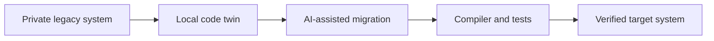
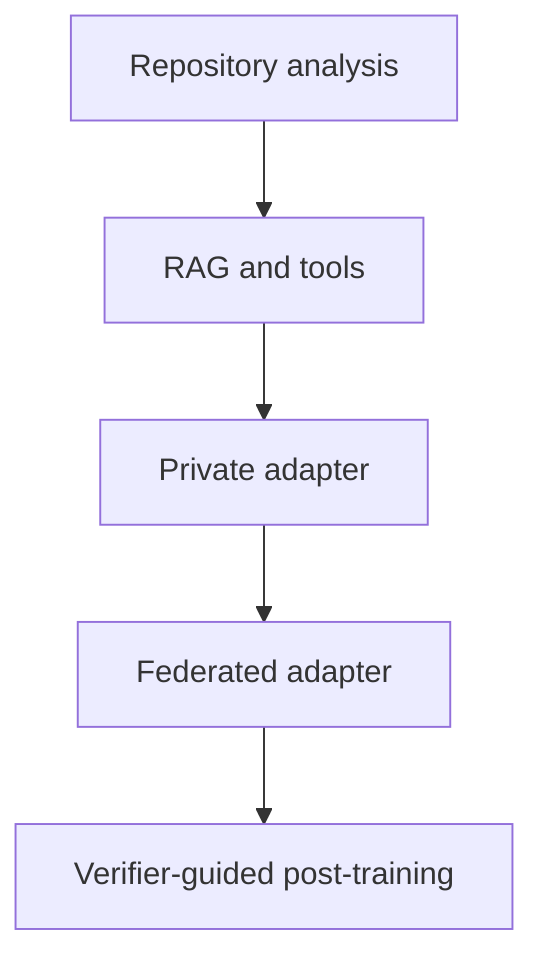

# Federated Coding for Legacy Modernisation

[Overview](README.md) · [Architecture](docs/en/architecture.md) · [Workflow](docs/en/workflow.md) · [Toolchain](docs/en/toolchain.md) · [Governance](docs/en/governance.md) · [Deutsch](de/README.md)

> Independent exploratory reference architecture. This is not an official NVIDIA product, legal opinion, customer implementation, or production approval.

## The executive idea

Critical business logic often lives in proprietary COBOL, JCL, PL/SQL, Oracle Forms, and related repositories. General coding assistants know public syntax and patterns, but not the private semantics, dependencies, exceptions, and operating history of a specific customer system.

This concept describes a customer-centric AI coding environment that understands and modernises legacy software locally without turning proprietary source code into a shared training corpus.

The primary objective is verified migration, not model training. Repository understanding, retrieval, transformation tools, compilers, and regression tests come first. Private or federated fine-tuning is introduced only when it produces measurable additional value.

## Why it matters

| Executive concern | Architectural response |
|---|---|
| Proprietary source code | Code, graphs, embeddings, and private adapters remain local |
| Weak legacy training coverage | Customer context is supplied through a local code twin and retrieval |
| Migration correctness | Compiler, tests, static analysis, and human review act as release authorities |
| Reusable migration capability | Only explicitly approved, abstracted learning objects may be federated |
| Copyright and licence contamination | Provenance, similarity, licence, and leakage gates block release |

## Core proposition

> The customer may use AI to modernise its own system. This does not automatically permit its code, business logic, or learned model components to benefit another customer.

The shared asset is therefore a migration capability, not a memory of customer code.

## What this repository contains

- a local-first architecture for legacy understanding and migration;
- a staged workflow from deterministic analysis to optional federated learning;
- an open-source-oriented NVIDIA fine-tuning and post-training toolchain;
- copyright, provenance, leakage, and verification controls;
- GitHub-renderable Markdown and Mermaid visuals.

It contains no customer repository, source file, dataset, model weight, adapter, checkpoint, executable POC, production configuration, or training run.

## Capability ladder

Each stage proceeds only if it outperforms the previous stage on migration quality, security, provenance, and cost.

## Recommended reading

1. [Architecture](docs/en/architecture.md)
2. [Workflow](docs/en/workflow.md)
3. [Toolchain](docs/en/toolchain.md)
4. [Governance](docs/en/governance.md)

Operational instructions are kept outside this executive narrative in [AGENTS.md](AGENTS.md), [PUBLICATION_POLICY.md](PUBLICATION_POLICY.md), and [CONTRIBUTING.md](CONTRIBUTING.md).

## Current status

Concept ready for executive and technical discussion. The next implementation step, if approved, is a synthetic vertical migration slice in a separate private repository. No customer delivery is performed here.
