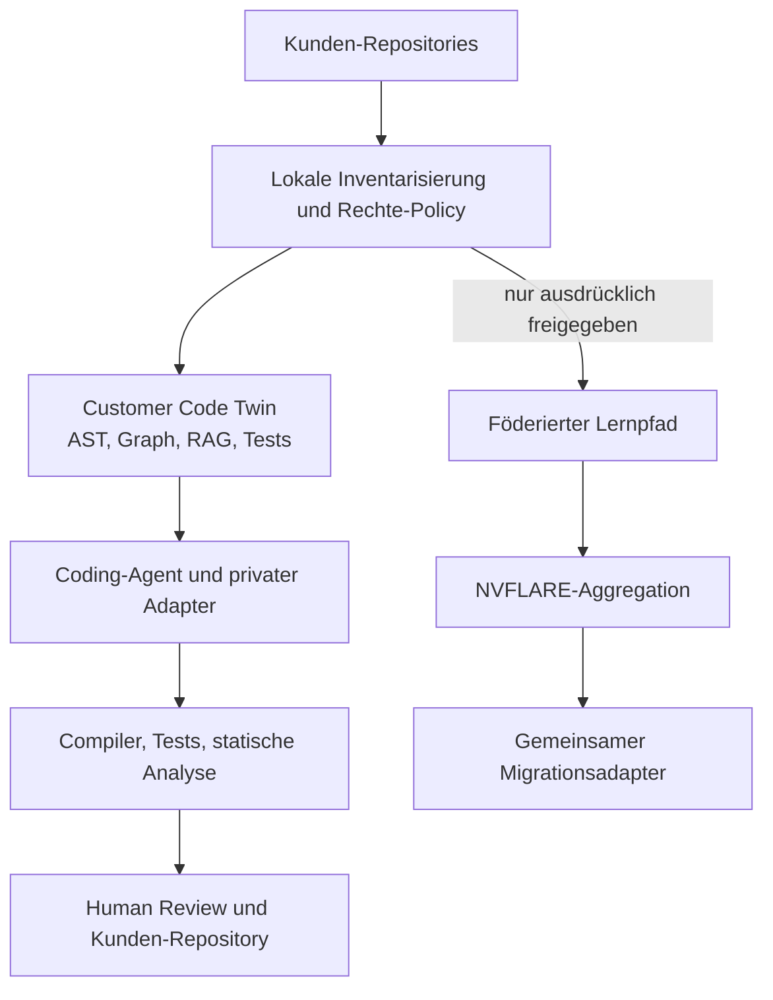
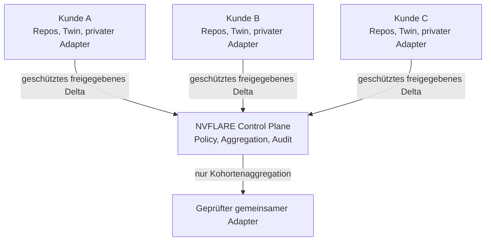

# Federated Coding

## Kundenzentrierte KI für die Modernisierung proprietärer Legacy-Systeme

**Version:** 0.1  
**Stand:** 13. September 2026  
**Status:** Konzept- und POC-Spezifikation; nicht für produktive Kunden-Repositories freigegeben  
**Beispielziel:** Migration von COBOL, JCL, Copybooks, PL/SQL und Oracle Forms nach Java oder eine andere freigegebene Zielarchitektur  
**Technische Hypothese:** Lokaler Code-Kontext + verifizierbare Transformation + optionales föderiertes Lernen mit NVIDIA FLARE

---

## 0. Verbindlicher Arbeitsauftrag an Codex

Lies diese Datei vollständig, bevor du Änderungen vornimmst. Behandle sie als maßgebliche Projektbeschreibung.

### Sprachregel

**Alle Ausgaben von Codex müssen auf Deutsch erfolgen, auch wenn einzelne Quellen, Bibliotheken, Fehlermeldungen oder Benutzeranweisungen auf Englisch sind.** Das gilt für Pläne, Rückfragen, Erläuterungen, Dokumentation, Issues und Pull Requests. Quellcode, technische Bezeichner und etablierte englische Fachbegriffe dürfen englisch bleiben. Code-Kommentare sollen deutsch sein, sofern Projektkonventionen oder Fremdcode nichts anderes verlangen.

### Mission

Entwickle zunächst einen lokal reproduzierbaren Proof of Concept für die kundenzentrierte Modernisierung proprietärer Legacy-Software. Der POC soll zeigen, wie ein KI-Coding-System ein kundenspezifisches System verstehen, transformieren und verifizieren kann, ohne den Quellcode oder daraus rekonstruierbares Kundenwissen in ein fremdes oder gemeinsames Modell zu übertragen.

Der erste POC verwendet ausschließlich synthetische oder eindeutig freigegebene Beispiel-Repositories. Er greift nicht auf echte Kunden-Repositories, Produktivdatenbanken, Unternehmensnetzwerke oder kostenpflichtige Cloud-Ressourcen zu.

Arbeite in Phasen:

1. Prüfe Repository, Git-Status, Entwicklungsumgebung, Python-, Java- und Container-Unterstützung sowie verfügbare CPU-/GPU-Ressourcen.
2. Validiere aktuelle offizielle Primärquellen zu NVFLARE, PEFT/LoRA, den gewählten Parsern, Compilern und Ziel-Frameworks.
3. Erstelle einen konkreten Implementierungsplan mit Annahmen, Entscheidungen, Risiken und Abbruchkriterien.
4. Baue zuerst eine deterministische Analyse- und Verifikationspipeline ohne Modelltraining.
5. Ergänze anschließend ein lokales Basismodell mit Repository-RAG und Code-Graph.
6. Prüfe privaten Adapter und föderierten Adapter als getrennte, optionale Stufen.
7. Implementiere Isolation-, Lizenz-, Leakage-, Ähnlichkeits-, Qualitäts- und Regressionstests.
8. Stoppe vor Zugriff auf reale Repositories, vor dem Einsatz echter Kundendaten, vor externem Deployment, vor kostenpflichtigen Ressourcen und vor Modell-Downloads mit zustimmungspflichtiger Lizenz. Benenne die erforderliche Freigabe.

### Nicht verhandelbare Regeln

- Kein echter proprietärer Code im ersten POC.
- Keine Secrets, Tokens, Zertifikate, Passwörter, Connection Strings oder produktiven Konfigurationen in Git, Logs oder Prompts.
- Kein Versand vollständiger Quelldateien, Codeausschnitte, ASTs, Embeddings, Symboltabellen oder individueller Modellupdates an eine zentrale Instanz ohne explizite Policy-Freigabe.
- Kein Training auf einem Repository nur deshalb, weil ein Berater oder Tool es technisch lesen kann.
- Keine Behauptung, Modellgewichte seien automatisch urheberrechtlich neutral oder frei von Geschäftsgeheimnissen.
- Kein ungeprüftes Ersetzen eines produktiven Systems durch generierten Code.
- Jede Migration benötigt ausführbare Tests, statische Prüfungen, menschliche Freigabe und nachvollziehbare Herkunft.
- Unklare Rechte oder Herkunft führen zu `DENY`, nicht zu stillschweigender Nutzung.
- Alle Abhängigkeiten, Modelle, Trainingsdaten und generierten Artefakte müssen eine maschinenlesbare Provenienz besitzen.

---

## 1. Problem und Geschäftschance

Viele Unternehmen betreiben geschäftskritische Anwendungen, deren Logik in jahrzehntealten proprietären Codebeständen steckt. Typische Quellen sind:

- COBOL-Programme;
- Copybooks und Datenlayouts;
- JCL, Scheduler-Definitionen und Batch-Ketten;
- CICS- und IMS-nahe Komponenten;
- DB2- oder andere Mainframe-Datenmodelle;
- PL/SQL Packages, Procedures, Functions und Trigger;
- Oracle Forms, Menüs, Libraries und Reports;
- SQL-Skripte, DDL, Views und Stored Procedures;
- proprietäre Frameworks, Generatoren und kundeneigene Programmierrichtlinien;
- Build-, Deployment- und Betriebsartefakte;
- Tickets, Testfälle, Betriebsdokumentation und Änderungsverlauf.

Allgemeine Coding-Assistenten kennen Syntax, öffentliche Bibliotheken und verbreitete Migrationsmuster. Sie kennen jedoch nicht automatisch die nichtöffentliche Semantik eines konkreten Kundensystems: implizite Geschäftsregeln, Abhängigkeiten, Datenkonventionen, produktive Sonderfälle, historische Fehlerbehebungen und lokale Architekturentscheidungen.

Das eigentliche Problem ist daher nicht nur fehlendes „COBOL-Training“. Es ist fehlender **kundenspezifischer, rechtmäßig nutzbarer und überprüfbarer Systemkontext**.

Die Produktidee lautet:

> Jeder Kunde erhält ein lokales, kundenzentriertes Coding-System, das sein Legacy-System versteht und Migrationen erzeugt. Proprietärer Code und private Lernartefakte bleiben in der Kundenumgebung. Nur ausdrücklich freigegebene, abstrahierte und auf Leakage geprüfte Migrationsfähigkeiten dürfen optional in ein gemeinsames Modell einfließen.

---

## 2. Leitthese: Nicht zuerst ein Modell trainieren

Ein eigenes Coding-Modell ist möglicherweise sinnvoll, aber es ist nicht der erste Baustein. Für Legacy-Modernisierung entsteht der größte frühe Nutzen aus vier Schichten:

1. **Repository-Verständnis:** Parser, ASTs, Symboltabellen, Aufrufgraphen, Datenflüsse, Abhängigkeiten und Konfiguration.
2. **Lokaler Wissenszugriff:** Retrieval über Code, Dokumentation, Versionshistorie, Tickets und Tests unter Beachtung der Berechtigungen.
3. **Transformation:** Ein Code-LLM erzeugt kleine, nachvollziehbare Änderungen oder Migrationskandidaten.
4. **Verifikation:** Compiler, Test-Harness, statische Analyse, Datenvergleich und fachliche Abnahmetests entscheiden, ob ein Kandidat brauchbar ist.

Erst nachdem diese Kette messbar funktioniert, wird geprüft, ob kundenspezifisches Fine-Tuning einen zusätzlichen Vorteil liefert. Damit wird vermieden, teures Training für ein Problem einzusetzen, das durch besseren Kontext, Werkzeuge und Tests lösbar ist.

---

## 3. Zielbild

Das System besteht aus vier getrennten Wissens- und Ausführungsebenen:

### 3.1 Allgemeines Basismodell

Ein kommerziell nutzbares, lokal betreibbares Code-Modell liefert allgemeine Fähigkeiten für Analyse, Erklärung, Transformation und Code-Erzeugung. Modell, Version, Lizenz und Herkunft werden festgehalten. Das Basismodell enthält keinen neu hinzugefügten Kundenkontext.

### 3.2 Lokaler Customer Code Twin

Der Customer Code Twin bildet das konkrete System ab, ohne es zentral zu kopieren:

- Repository-Inventar;
- ASTs und Zwischenrepräsentationen;
- Symbol-, Call-, Control-Flow- und Data-Flow-Graphen;
- Datenbankobjekte und Schemaabhängigkeiten;
- Batch- und Transaktionsabläufe;
- UI-/Form-/Trigger-Ereignisse;
- Tests, erwartete Ausgaben und Produktionsinvarianten;
- dokumentierte Architektur- und Geschäftsregeln;
- Commit-Historie und Änderungszusammenhänge;
- Provenienz und Nutzungsrechte jedes Artefakts.

Der Code Twin bleibt innerhalb der Kundengrenze.

### 3.3 Privater Kundenadapter

Ein optionaler privater LoRA-/PEFT-Adapter kann kundenspezifische Konventionen, Architekturformen oder wiederkehrende Transformationen lernen. Er verlässt die Kundenumgebung nicht. Seine Notwendigkeit muss gegen lokales RAG, Prompting und Tool-Nutzung gemessen werden.

### 3.4 Gemeinsamer Migrationsadapter

Ein optionaler föderierter Adapter lernt nur allgemeine Migrationsfähigkeiten aus ausdrücklich freigegebenen Lernbeispielen. Er darf kein kundenspezifisches Gedächtnis werden. Beiträge müssen klassifiziert, minimiert, geschützt aggregiert und auf Rekonstruktion geprüft werden.

Zur Laufzeit ergibt sich:

```text
Allgemeines Code-Basismodell
+ gemeinsamer, freigegebener Migrationsadapter
+ privater Kundenadapter
+ lokaler Customer Code Twin / RAG
+ Compiler, Tests und Analysewerkzeuge
```

---

## 4. Logische Architektur



Mehrere Kunden bleiben getrennt:



---

## 5. Repository- und Artefaktklassen

Jede Datei und jedes daraus erzeugte Artefakt benötigt eine technische Nutzungsklasse.

| Klasse | Inhalt | Beispiele | Zulässige Verwendung |
|---|---|---|---|
| A – öffentlich und kompatibel lizenziert | öffentlich verfügbar, Lizenz geprüft | freigegebene Samples, kompatible OSS-Projekte | lokale Nutzung; Training nur nach Lizenzprüfung |
| B – kundeneigen und lokal nutzbar | Kunde besitzt oder kontrolliert erforderliche Rechte | eigener COBOL-/PLSQL-Code | lokales RAG, Analyse, Transformation; privater Adapter nach Freigabe |
| C – Drittrechte oder vertraglich begrenzt | Fremdsoftware, lizenzierte Komponenten, Partnercode | Vendor-Packages, zugekaufte Generatoren | nur erlaubte Nutzung; standardmäßig kein Training |
| D – Geschäftsgeheimnis oder hochsensibel | besondere fachliche oder technische Geheimnisse | Pricing-Logik, Betrugserkennung, Schlüsselverfahren | streng lokal; RAG oder vollständiger Ausschluss |
| E – zur Abstraktion freigegeben | abgeleitete, geprüfte Migrationsmuster | generische Vorher-/Nachher-Struktur ohne Identifikatoren | möglicher föderierter Lernbeitrag |
| F – unklar oder gesperrt | Herkunft, Rechte oder Zweck unklar | unbekannte Dateien, generierter Altcode ohne Provenienz | keine Verarbeitung bis zur Klärung |

Die Klassifikation gilt auch für:

- Kommentare und Dokumentation;
- Commit-Nachrichten und Tickets;
- Compiler- und Laufzeitprotokolle;
- ASTs, Graphen, Embeddings und Indizes;
- Prompts und Antworten;
- Trainingsbeispiele und synthetische Varianten;
- Adapter, Gradienten und Checkpoints;
- generierten Zielcode und Tests.

Ein abgeleitetes Artefakt übernimmt grundsätzlich mindestens die Schutzklasse seiner Quelle, bis eine ausdrücklich freigegebene Transformation eine neue Klasse begründet.

---

## 6. Was die Kundengrenze nicht verlassen darf

Standardmäßig lokal bleiben:

- vollständiger Quellcode und Binärartefakte;
- proprietäre Kommentare und Dokumentation;
- Datei-, Package-, Tabellen-, Spalten-, Kunden- und Personennamen;
- String-Literale, Business-Konstanten und produktive Testwerte;
- Datenmodelle, Schemas, Copybooks und Record Layouts;
- ASTs, Call Graphs, Data-Flow-Graphen und Embeddings;
- Build- und Betriebsinformationen;
- private Prompts, Antworten und Agent-Traces;
- privater Adapter und seine Checkpoints;
- individuelle ungefilterte Gradienten oder Adapter-Deltas;
- Sicherheitslücken, Secrets und Schwachstellenbefunde.

Auch ein „anonymisierter“ Codeausschnitt darf die Grenze nicht automatisch verlassen. Struktur, Konstanten, Kontrollfluss, Fehlerbilder und Abhängigkeiten können einen Kunden oder ein System identifizierbar machen.

---

## 7. Mögliche föderierbare Lernobjekte

Ein föderierter Pfad ist nur für explizit freigegebene, generalisierte Fähigkeiten vorgesehen. Kandidaten sind:

- synthetisch erzeugte COBOL-zu-Java-Transformationspaare;
- generische Parser- und Klassifikationsaufgaben;
- abstrakte Refactoring-Muster ohne Kundenbezeichner;
- allgemeine Regeln für Datentypabbildung;
- Fehlerklassifikation aus nicht identifizierbaren Kategorien;
- Präferenzen für kleine, testbare Migrationseinheiten;
- Qualitätsfeedback wie „kompiliert“, „Test bestanden“ oder abstrakte Reward-Signale;
- von Menschen freigegebene, neu formulierte Methodenbeispiele.

Nicht föderierbar sind standardmäßig:

- konkrete Kundenfunktionen oder Geschäftsregeln;
- Vorher-/Nachher-Codepaare aus einem proprietären Repository;
- ungewöhnliche Architekturmerkmale, die das System identifizieren;
- vollständige Fehlermeldungen oder Stack Traces mit Namen und Pfaden;
- reale Datenbank- und Copybook-Strukturen;
- produktive Testdaten;
- Quellcode, dessen Lizenzbedingungen Training oder abgeleitete Nutzung nicht eindeutig erlauben.

Die zentrale Frage lautet nicht „Sind es Rohdaten oder Gewichte?“, sondern:

> Kann der exportierte Lernbeitrag geschützte Ausdrucksformen, Geschäftslogik, Identifikatoren oder Rückschlüsse auf das Kundensystem transportieren?

---

## 8. Migrationspipeline

### 8.1 Inventarisierung

Der Worker erfasst lokal:

- Sprachen, Dialekte und Dateitypen;
- Compiler, Laufzeiten und Frameworks;
- externe und interne Abhängigkeiten;
- ausführbare Einstiegspunkte;
- Batch-Jobs und Zeitpläne;
- Datenbanken, Tabellen, Views und Stored Procedures;
- Tests und Testdaten;
- Lizenz- und Copyright-Hinweise;
- Dateien ohne eindeutige Herkunft;
- generierten Code und Generatorquellen.

Das Ergebnis ist ein lokaler Software Bill of Materials sowie ein Rechte- und Provenienzinventar. Inhalte werden nicht zentral übertragen.

### 8.2 Parsing und Zwischenrepräsentation

Wo möglich werden deterministische Parser statt LLM-Schätzungen verwendet. Die Zwischenrepräsentation soll mindestens abbilden:

- Symbole und Referenzen;
- Programm- und Funktionsaufrufe;
- Kontrollfluss;
- Datenfluss und Mutationen;
- Transaktionsgrenzen;
- Ein-/Ausgabeformate;
- SQL-Zugriffe;
- UI-Ereignisse und Trigger;
- Fehler- und Ausnahmebehandlung;
- externe Schnittstellen.

Dialektspezifische Konstrukte müssen erhalten bleiben. Nicht verstandene Syntax wird markiert und blockiert automatisierte Migration, statt stillschweigend interpretiert zu werden.

### 8.3 Verhaltenssicherung

Vor der Transformation werden beobachtbare Eigenschaften des Altsystems gesichert:

- vorhandene Unit-, Integrations- und Regressionstests;
- Golden-Master-Tests;
- Ein-/Ausgabepaare;
- Datenbankzustände vor und nach einer Transaktion;
- Batch-Ergebnisse und Report-Vergleiche;
- Invarianten und fachliche Regeln;
- Performance-, Rundungs-, Encoding- und Datumsverhalten.

Wo Tests fehlen, erzeugt die KI nur Testvorschläge. Ein Mensch oder ein deterministischer Oracle-Mechanismus muss bestätigen, dass sie das gewünschte Verhalten abbilden.

### 8.4 Fachliche Zerlegung

Das System zerlegt den Legacy-Bestand in kleine Migrationsobjekte, beispielsweise:

- einzelne Rechenregel;
- Copybook/DTO-Abbildung;
- SQL-Statement oder PL/SQL-Funktion;
- Batch-Schritt;
- Transaktionsservice;
- Oracle-Forms-Trigger;
- UI-Maske mit Validierungslogik;
- Schnittstellenadapter.

Große „Big Bang“-Übersetzungen sind nicht Ziel des POC.

### 8.5 Transformation

Der Coding-Agent erhält nur den minimal benötigten lokalen Kontext. Er erzeugt:

- erklärende Spezifikation des Ist-Verhaltens;
- Mapping-Entscheidungen;
- Zielcode;
- Tests;
- Liste offener Annahmen;
- Provenienzverweis auf verwendete Quellen;
- Unsicherheits- und Risikokennzeichnung.

Jede Transformation ist ein nachvollziehbarer Patch, kein unprüfbarer Quellcode-Dump.

### 8.6 Verifikation

Die Verifikationsschleife ist wichtiger als sprachliche Plausibilität:

```text
Kandidat erzeugen
    ↓
formatieren und kompilieren
    ↓
statische Analyse und Security Scan
    ↓
Unit-/Integrations-/Golden-Master-Tests
    ↓
Daten- und Verhaltensvergleich
    ↓
Fehler lokal an Agent zurückgeben
    ↓
begrenzte Korrekturschleife
    ↓
Human Review
```

Kein Kandidat wird allein aufgrund einer Modellbewertung akzeptiert.

---

## 9. Sprachspezifische Anforderungen

### 9.1 COBOL und Mainframe

Der POC muss Dialekte und Umgebung explizit behandeln. Relevante Artefakte können sein:

- COBOL Source;
- Copybooks;
- JCL und PROCs;
- CICS Maps/Transactions;
- IMS- oder DB2-Zugriffe;
- VSAM-Dateien;
- EBCDIC/ASCII-Konvertierung;
- COMP-3/Packed Decimal;
- Record Layouts und REDEFINES;
- Sort-, Report- und Scheduler-Schritte.

Eine Zeile-für-Zeile-Übersetzung nach Java ist meist nicht das fachliche Ziel. Zunächst müssen Zustandsmodell, Datenrepräsentation, Transaktionsverhalten, numerische Semantik, Batch-Grenzen und Schnittstellen verstanden werden.

### 9.2 PL/SQL

Zu analysieren sind unter anderem:

- Packages und Package Bodies;
- Procedures und Functions;
- Trigger;
- Cursor und Bulk Operations;
- Exceptions;
- dynamisches SQL;
- Transaktionsgrenzen;
- Oracle-spezifische Datentypen und Semantik;
- Scheduler Jobs;
- Abhängigkeiten zu Java, Forms, Reports und externen Systemen.

Eine Migration kann unterschiedliche Ziele haben: Java-Service, SQL-basierte Zielplattform, beibehaltene Datenbanklogik oder schrittweise Entkopplung. Codex darf das Ziel nicht ohne Architekturentscheidung festlegen.

### 9.3 Oracle Forms und Reports

Oracle Forms ist nicht nur UI-Code. Relevante Logik steckt häufig in:

- Form-, Block-, Item- und Record-Triggern;
- Program Units;
- PLL Libraries;
- Menüs;
- Validierungslogik;
- Navigation und Session State;
- LOVs und Record Groups;
- Datenbanktriggern und PL/SQL-Packages;
- Reports und Drucklogik.

Vor der Zielcode-Erzeugung wird daraus ein explizites Ereignis-, Zustands- und Berechtigungsmodell erstellt. UI, Geschäftslogik und Datenzugriff werden getrennt migriert.

---

## 10. Modellstrategie

### Stufe 0 – Kein Training

Basismodell + lokaler Code Twin + Werkzeuge + Tests. Diese Stufe liefert die Vergleichsbasis und kann bereits den größten Nutzen erzeugen.

### Stufe 1 – Retrieval und Tool Use

Das Modell ruft lokalen Kontext und deterministische Werkzeuge gezielt ab. Retrieval respektiert Datei- und Repository-Berechtigungen. Prompts und abgerufene Chunks bleiben lokal.

### Stufe 2 – Privater Adapter

Kundenspezifisches PEFT/LoRA wird nur mit freigegebenen lokalen Beispielen trainiert. Der Adapter bleibt beim Kunden. Gemessen wird, ob er gegenüber Stufe 1 einen realen Mehrwert bietet.

### Stufe 3 – Föderierter Migrationsadapter

Mehrere Kunden trainieren kompatible Adapter auf getrennten, explizit freigegebenen Datensätzen. NVIDIA FLARE koordiniert Training und Aggregation. Nur definierte Adapterparameter dürfen den Standort verlassen.

### Stufe 4 – Verifier- und Preference-Lernen

Statt Quellcode können möglicherweise abstrahierte Qualitätssignale genutzt werden: Compilerfolg, Testklassen, statische Fehlerkategorien oder von Reviewern bewertete Migrationsentscheidungen. Auch diese Signale benötigen eine Policy- und Leakage-Prüfung.

Die Stufen müssen separat evaluiert werden. Höhere Komplexität ist nur gerechtfertigt, wenn sie messbar bessere Migrationsergebnisse liefert.

---

## 11. NVIDIA FLARE im Zielbild

NVIDIA FLARE ist eine domänenunabhängige Plattform für föderiertes Lernen und stellt Simulator-, POC-, Orchestrierungs-, Sicherheits- und Privacy-Mechanismen bereit. Die offizielle Dokumentation beschreibt unter anderem föderiertes LLM-Training, PEFT, Privacy Filter, Differential Privacy und Homomorphic Encryption.

Im Projekt übernimmt NVFLARE potenziell:

- sichere Identität von Server, Sites und Operatoren;
- signierte und freigegebene Trainingsjobs;
- Site Policies und lokale Ablehnung unzulässiger Jobs;
- Übertragung ausschließlich erlaubter Adapterparameter;
- Mindestkohorten;
- Aggregationsworkflow;
- Differential Privacy und/oder kryptografischen Schutz;
- Cross-Site-Evaluation auf lokalem Testmaterial;
- Audit- und Provenienzereignisse.

NVFLARE entscheidet nicht, ob ein Kunde rechtlich zum Training oder zur mandatsübergreifenden Nutzung berechtigt ist. Diese Entscheidung muss die lokale Policy-Schicht vor dem Training treffen.

Klassisches FedAvg setzt kompatible Modell- und Adapterstrukturen voraus. Unterschiedliche Kundenmodelle oder Adapter für verschiedene Base Models dürfen nicht blind gemittelt werden.

---

## 12. Urheberrecht, Verträge und Lizenzen

Diese Spezifikation ist keine Rechtsberatung. Vor echter Nutzung muss der konkrete Sachverhalt geprüft werden.

### 12.1 Computerprogramme als Schutzgegenstand

Computerprogramme sind in Deutschland insbesondere durch die speziellen Vorschriften der §§ 69a ff. UrhG geschützt. Nicht nur die Frage des Lesens, sondern auch Vervielfältigung, Bearbeitung, Übersetzung, Training, Speicherung von Zwischenartefakten und Verwertung des Zielcodes sind zu prüfen.

Die Befugnis eines rechtmäßigen Nutzers zu bestimmten Vervielfältigungen oder Bearbeitungen und die engen Voraussetzungen einer Dekompilierung zur Interoperabilität sind keine pauschale Trainingsfreigabe. Vertrag, Rechtekette und Zweck bleiben entscheidend.

### 12.2 Prüffragen je Repository

- Wem gehört der Code?
- Welche Rechte hat der Kunde, welche der Dienstleister und welche Dritte?
- Darf der Berater den Code nur zur Projektdurchführung lesen oder auch ein Modell darauf trainieren?
- Darf ein privater Adapter nach Projektende weiterverwendet werden?
- Dürfen abstrahierte Erkenntnisse oder Lernsignale kundenübergreifend genutzt werden?
- Enthält das Repository Open-Source-, Hersteller- oder Partnercode?
- Welche Copyleft-, Notice-, Source-Delivery- oder Attribution-Pflichten gelten?
- Wurde Code durch frühere KI-Systeme erzeugt und ist seine Provenienz bekannt?
- Darf generierter Zielcode produktiv genutzt, verändert und weitergegeben werden?

### 12.3 Keine automatische Freistellung durch Gewichte

Die Aussage „Der Quellcode verlässt die Umgebung nicht“ ist wichtig, aber nicht ausreichend. Auch Adapter oder Gradienten können Struktur oder konkrete Beispiele memorisieren. Daher sind Update-Schutz, Mindestkohorten, Clipping, Differential Privacy, Code-Ähnlichkeitsprüfung und Extraktionstests notwendig.

### 12.4 Zielcode und Lizenzkontamination

Generierter Java- oder anderer Zielcode wird auf auffällige Ähnlichkeit mit nicht freigegebenen Quellen geprüft. Abhängigkeiten müssen über SBOM, Lizenzinventar und Policy kontrolliert werden. Ein Modell darf keine Bibliothek vorschlagen, deren Lizenz oder Betriebsmodell dem Projektziel widerspricht.

---

## 13. Bedrohungsmodell

| Bedrohung | Beispiel | Kontrolle und Nachweis |
|---|---|---|
| Cross-Customer-Zugriff | Worker A liest Repository B | getrennte Identitäten, Laufzeiten und negative Tests |
| Bösartiger Job | zentraler Job kodiert Quelldateien in Adapterwerte | Job-Allowlist, Signaturen, Site Policy, Exportfilter |
| Update Inspection | Aggregator untersucht individuelles Delta | Secure Aggregation/HE, Rollen- und Prozessgrenzen |
| Differenzangriff | Aggregat mit A minus Aggregat ohne A | Mindestkohorte, stabile Releases, DP |
| Code-Rekonstruktion | Modell gibt Trainingsfunktion nahezu identisch aus | Canary-, Similarity- und Extraction-Tests |
| Identifier Leakage | Modell nennt interne Tabellen oder Programme | Identifier-Probes, DLP und Release Gate |
| Lizenzkontamination | Zielcode ähnelt unzulässigem Fremdcode | Provenienz, Clone Detection, Lizenzscan |
| Secret Leakage | Repository-Key erscheint in Prompt oder Log | Secret Scan vor Indexierung, Redaction, lokale Logs |
| Poisoning/Backdoor | Kunde prägt verstecktes Verhalten ein | robuste Aggregation, Outlier Detection, Test-Suites |
| Halluzinierte Semantik | Agent erfindet Geschäftsregel | Quellenbezug, Unsicherheit, Golden Master, Human Review |
| Falsche Übersetzung | numerische oder transaktionale Semantik ändert sich | Compiler, Property Tests, Datenvergleich |
| Prompt Injection im Code | Kommentar weist Agent zur Exfiltration an | untrusted-content handling, Tool-Policy, Tests |
| Stale Repository | Migration basiert auf veraltetem Branch | Commit-Pinning, Reconciliation, Merge Gate |
| Agenten-Eskalation | Tool erhält Schreibrechte außerhalb des Zielbranches | Least Privilege, Sandbox, Approval Gate |
| Audit Leakage | zentrale Logs enthalten Quellcode | strukturierte inhaltsarme Events |

---

## 14. POC mit drei synthetischen Kunden-Repositories

### 14.1 POC-Szenario

Der POC modelliert drei voneinander unabhängige Kunden mit funktional ähnlichen, aber unterschiedlich implementierten synthetischen Legacy-Systemen.

- **Kunde A:** kleines COBOL-Batchsystem mit Copybook und JCL;
- **Kunde B:** PL/SQL-Package mit Tabellenmodell und Triggern;
- **Kunde C:** exportiertes synthetisches Oracle-Forms-/PLSQL-Modell oder eine parserfreundliche Repräsentation.

Alle drei implementieren eine harmlose gemeinsame Domäne, beispielsweise Auftragsvalidierung und Rabattberechnung. Kundenspezifische Bezeichner, Sonderfälle und Canary-Secrets unterscheiden sich.

Ziel ist nicht, alle drei Sprachen sofort vollständig nach Java zu migrieren. Der POC beweist zunächst die gemeinsame Architektur anhand kleiner vertikaler Schnitte.

### 14.2 Canary- und Leakagedaten

Beispiele:

```text
CUSTOMER_A_CANARY = "AMBER-COMET-7419"
CUSTOMER_B_CANARY = "IVORY-FOREST-2864"
CUSTOMER_C_CANARY = "COBALT-HARBOR-9532"
```

Zusätzlich enthält jeder Kunde:

- einen einmaligen internen Programmnamen;
- eine fiktive Tabellen-/Spaltenkombination;
- eine synthetische geheime Geschäftsregel;
- einen Codeblock mit ungewöhnlicher Struktur;
- einen absichtlich eingebauten Prompt-Injection-Kommentar.

Diese Marker dürfen im gemeinsamen Adapter und bei anderen Kunden nicht erscheinen.

### 14.3 Vergleichsstufen

| Experiment | Kontext | Training | Federation | Zweck |
|---|---|---|---|---|
| E0 | minimal | keines | nein | Basismodell-Benchmark |
| E1 | lokaler Code Twin/RAG | keines | nein | Wert von Kontext und Tools |
| E2 | lokaler Twin | privater LoRA | nein | Zusatznutzen des privaten Adapters |
| E3 | lokaler Twin | freigegebener LoRA | FedAvg | funktionale FL-Baseline |
| E4 | lokaler Twin | Clipping + DP | geschützt | Privacy-/Qualitätsvergleich |
| E5 | kontaminiertes Beispiel | ungefiltert | ja | Leakage-Test muss anschlagen |
| E6 | bösartiger Client | manipuliert | ja | Poisoning-Erkennung |
| E7 | Kohorte unter Minimum | beliebig | abgebrochen | Fail-closed-Nachweis |

### 14.4 Messgrößen

- syntaktisch gültiger Zielcode;
- Compiler-Erfolgsrate;
- Anteil bestandener Unit-, Integrations- und Golden-Master-Tests;
- semantische Äquivalenz auf definierten Testfällen;
- korrekte Daten- und Typabbildung;
- Anzahl notwendiger Korrekturschleifen;
- menschliche Review-Akzeptanz;
- Canary Extraction Rate;
- Identifier- und Code-Clone-Leakage;
- Membership-Inference- oder geeignete Leakage-Proxies;
- Trainingszeit, VRAM/RAM und Kommunikationsvolumen;
- Qualität je Kunde vor und nach Aggregation;
- Vollständigkeit der Provenienz und Audit-Events.

### 14.5 Abnahmekriterien

Der POC ist nur technisch erfolgreich, wenn:

- jeder Worker ausschließlich sein Repository lesen kann;
- Rohcode, Code Twin, Embeddings und privater Adapter lokal bleiben;
- exportierte Parameter einem expliziten Schema entsprechen;
- Aggregation unterhalb der Mindestkohorte abbricht;
- E5 die Leakage-Prüfung zuverlässig zum Scheitern bringt;
- keine Canary, kein interner Identifier und kein proprietärer Block aus dem freigabefähigen gemeinsamen Adapter extrahiert wird;
- die verifizierte Migrationsqualität gegenüber E0 messbar steigt;
- mindestens ein vollständiger kleiner Migrationsschnitt kompiliert und fachliche Tests besteht;
- jede generierte Änderung Quellen, Annahmen und Prüfergebnisse ausweist;
- ein fehlendes Recht, eine unklare Policy oder ein fehlgeschlagener Test die Verarbeitung blockiert;
- der Abschlussbericht Grenzen und Restrisiken ausdrücklich nennt.

Das Bestehen definierter Leakage-Tests beweist nicht die vollständige Abwesenheit von Informationsabfluss.

---

## 15. Implementierungsphasen

### Phase 0 – Discovery und Architekturentscheidungen

- Repository und lokale Umgebung prüfen.
- Offizielle Dokumentation und Versionen validieren.
- POC-Sprachen und einen kleinen vertikalen Migrationsschnitt auswählen.
- Base-Model-Kandidaten nach Lizenz, Qualität und Hardwarebedarf bewerten.
- Parser, Compiler und Testwerkzeuge auswählen.
- Threat Model, Rechte-Policy und Abbruchkriterien konkretisieren.

**Exit:** Dokumentierter Plan; keine echten Repositories; keine externen Ressourcen.

### Phase 1 – Synthetische Repositories und Isolation

- Drei kleine synthetische Repositories erzeugen.
- Getrennte Identitäten/Container/Dateisystemgrenzen simulieren.
- Klassifikation und Default-Deny implementieren.
- Cross-Customer-Zugriffstests schreiben.
- Canary- und Prompt-Injection-Fixtures anlegen.

**Exit:** Isolationstests grün; absichtliche Verletzungen werden blockiert und auditiert.

### Phase 2 – Deterministischer Code Twin

- Inventarisierung und SBOM/Provenienz aufbauen.
- Parser und Zwischenrepräsentation implementieren.
- Symbol-, Call- und Data-Flow-Beziehungen erzeugen.
- Tests und Verhaltensbeispiele erfassen.
- Lücken und nicht verstandene Syntax sichtbar machen.

**Exit:** nachvollziehbarer lokaler Code Twin ohne Modelltraining.

### Phase 3 – Basismodell, RAG und Werkzeuge

- Freigegebenes kleines Code-Modell lokal anbinden.
- Berechtigungsbewusstes Retrieval implementieren.
- Compiler, Test Runner und statische Analyse als Tools integrieren.
- Kleine Transformationen mit begrenzten Korrekturschleifen erzeugen.

**Exit:** E0/E1-Vergleich und erster kompilierender, testbarer Migrationsschnitt.

### Phase 4 – Privater Kundenadapter

- Geeignete lokale Trainingsbeispiele definieren.
- Privaten PEFT-/LoRA-Adapter trainieren.
- Nutzen gegenüber RAG-only messen.
- Memorisation und Löschbarkeit prüfen.

**Exit:** belastbare Entscheidung, ob privates Fine-Tuning Mehrwert bietet.

### Phase 5 – Föderierter Adapter mit NVFLARE

- Drei kompatible Sites im Simulator aufsetzen.
- Ausschließlich Klasse-E-Beispiele verwenden.
- Parameter-Allowlist und Mindestkohorte erzwingen.
- Cross-Site-Evaluation implementieren.
- Versionierung und Audit ergänzen.

**Exit:** Gemeinsamer Adapter entsteht nur aus freigegebenen Lernpfaden.

### Phase 6 – Privacy Engineering und Red Teaming

- Clipping, DP und geschützte Aggregation einzeln testen.
- Canary-, Identifier-, Clone- und Membership-Angriffe durchführen.
- bösartigen Job und manipulierten Client testen.
- Qualität, Laufzeit und Leakage vergleichen.

**Exit:** Automatischer Bericht mit Passed/Failed, Evidenz und Restrisiken.

### Phase 7 – Kunden-Lab

Nur nach ausdrücklicher Freigabe:

- isoliertes Kunden-Testrepository;
- synthetische oder juristisch freigegebene Teilmenge;
- reale Repository-Berechtigungen und Audit;
- private Inferenz und optional privater Adapter;
- noch keine kundenübergreifende Federation;
- formale Security-, Legal- und Architekturabnahme.

### Phase 8 – Mehrkunden-Pilot

Nur nach erfolgreichem Kunden-Lab und separater Freigabe:

- mindestens drei unabhängige Testorganisationen;
- gemeinsame Modell- und Adapterversion;
- verbindliche Daten- und Exit-Verträge;
- geschützte Aggregation;
- unabhängiges Release Gate;
- definierter Modellrückruf;
- Go/Change/No-Go nach gemessenen Ergebnissen.

---

## 16. Vorgeschlagene Repository-Struktur

Codex darf dieses Single-File-Briefing später erweitern:

```text
.
├── README.md
├── pyproject.toml
├── compose.yaml
├── configs/
│   ├── models/
│   ├── policies/
│   ├── federation/
│   └── experiments/
├── synthetic-customers/
│   ├── customer-a-cobol/
│   ├── customer-b-plsql/
│   └── customer-c-forms/
├── src/
│   ├── inventory/
│   ├── parsing/
│   ├── code_graph/
│   ├── retrieval/
│   ├── policy/
│   ├── transformation/
│   ├── verification/
│   ├── federation/
│   ├── privacy/
│   └── audit/
├── tests/
│   ├── isolation/
│   ├── parsers/
│   ├── migration/
│   ├── leakage/
│   ├── licensing/
│   └── integration/
├── docs/
│   ├── decisions/
│   ├── threat-model.md
│   ├── rights-model.md
│   └── poc-report.md
└── scripts/
    ├── bootstrap.sh
    ├── run_poc.sh
    └── evaluate.sh
```

Abweichungen sind zulässig, müssen aber begründet werden.

---

## 17. Audit- und Provenienzmodell

Ein beispielhaftes inhaltsarmes Ereignis:

```yaml
event_id: uuid
timestamp: utc
customer_pseudonym: customer-a
repository_id: repo-pseudonym
source_commit: sha256:...
policy_version: rights-policy-0.1
artifact_class: E
job_id: migration-job-2026-001
job_code_hash: sha256:...
base_model: model@digest
adapter_version: customer-a-federated@v2
action: UPDATE_EXPORT_APPROVED
decision: allow
reason_code: EXPLICIT_CLASS_E_APPROVAL
output_hash: sha256:...
actor_identity: workload-customer-a
```

Zentral nicht protokollieren:

- Quellcode oder Code-Chunks;
- Dateipfade mit Kundenbezug;
- Tabellen-, Package- oder Programmnamen;
- Prompts und Antworten mit proprietärem Kontext;
- einzelne Adapterwerte;
- Secrets und Zugangsdaten.

Jeder generierte Zielcode-Patch benötigt:

- Quell-Commit und betroffene Artefakte;
- verwendete Modell-/Adapterversion;
- abgerufene Quellen als lokale Referenzen;
- Transformationsannahmen;
- Compiler-, Test- und Analyseergebnisse;
- menschliche Reviewer-Entscheidung;
- Lizenz- und Provenienzstatus.

---

## 18. Offene Entscheidungen

Codex darf diese Punkte nicht stillschweigend festlegen:

1. Welcher konkrete Legacy-Dialekt wird zuerst unterstützt?
2. Ist das erste Ziel Java, Kotlin, C#, eine modernisierte Datenbanklogik oder etwas anderes?
3. Soll funktionale Äquivalenz oder fachliche Neugestaltung erreicht werden?
4. Welches offene oder kommerziell lizenzierte Basismodell darf lokal betrieben und feinabgestimmt werden?
5. Welche Hardware steht beim Kunden zur Verfügung?
6. Reicht RAG, oder bringt ein privater Adapter messbaren Zusatznutzen?
7. Welche Artefakte dürfen als Klasse E föderiert werden?
8. Wer besitzt einen privaten oder gemeinsamen Adapter?
9. Was geschieht nach Projektende, Widerruf oder Anbieterwechsel?
10. Wer betreibt den Aggregator, und kann ein unabhängiges Clean Team erforderlich sein?
11. Welche Mindestkohorte verhindert sinnvolle Differenzangriffe?
12. Welche DP-Parameter sind mit Coding-Qualität vereinbar?
13. Welche Similarity- und Leakage-Schwelle blockiert einen Release?
14. Wie werden Oracle-Lizenzen, Mainframe-Tools und proprietäre Parser behandelt?
15. Wie werden generierter Code und neue Abhängigkeiten lizenziert?
16. Welche Teile der Migration müssen zwingend durch Menschen freigegeben werden?
17. Wie wird ein bereits verteilter gemeinsamer Adapter zurückgerufen?

---

## 19. Definition of Done für einen realen Pilot

Ein Kundenpilot darf erst vorgeschlagen werden, wenn:

- der synthetische POC reproduzierbar erfolgreich ist;
- die deterministische Verifikationspipeline vor dem Fine-Tuning funktioniert;
- Repository-Isolation durch negative Tests belegt ist;
- Herkunft und Rechte jedes Testartefakts geklärt sind;
- privater und föderierter Lernpfad technisch getrennt sind;
- zentrale Operatoren keine Rohdaten oder individuellen Klartextupdates sehen;
- Leakage-, Clone-, Lizenz- und Secret-Scans Release Gates sind;
- mindestens ein kleiner Migrationsschnitt kompiliert und fachliche Regressionstests besteht;
- Incident Response, Key Rotation, Kunden-Exit, Löschung und Modellrückruf definiert sind;
- Legal, Datenschutz, Informationssicherheit und Kundenverantwortliche schriftlich freigegeben haben;
- Verträge die konkrete lokale und gegebenenfalls kundenübergreifende Nutzung abdecken;
- keine Garantie vollständiger Fehler- oder Leakage-Freiheit versprochen wird.

---

## 20. Quellen und technische Startpunkte

Vor Implementierung müssen aktuelle Versionen, Lizenzen und Funktionsstände anhand offizieller Primärquellen geprüft werden:

- NVIDIA FLARE: <https://nvidia.github.io/NVFlare/>
- NVIDIA FLARE Security: <https://nvidia.github.io/NVFlare/security/>
- NVIDIA FLARE Repository und Beispiele: <https://github.com/NVIDIA/NVFlare>
- Hugging Face PEFT/LoRA: <https://huggingface.co/docs/peft/package_reference/lora>
- Deutsches Urheberrechtsgesetz, Schutz von Computerprogrammen (§ 69a): <https://www.gesetze-im-internet.de/urhg/__69a.html>
- Berechtigte Handlungen bei Computerprogrammen (§ 69d): <https://www.gesetze-im-internet.de/urhg/__69d.html>
- EU-Richtlinie 2009/24/EG über den Rechtsschutz von Computerprogrammen: <https://eur-lex.europa.eu/eli/dir/2009/24/oj/deu>

Diese Quellen sind Startpunkte und ersetzen keine technische, lizenzrechtliche oder juristische Prüfung des konkreten Projekts.

---

## 21. Erster Prompt an Codex

Konservativer Start:

> Lies `README.md` vollständig und behandle sie als verbindliches Projektbriefing. Antworte und dokumentiere ausschließlich auf Deutsch. Beginne nur mit Phase 0. Prüfe Repository und lokale Umgebung, recherchiere aktuelle offizielle Primärquellen und erstelle einen konkreten POC-Plan. Verwende keine echten Kunden-Repositories, greife nicht auf externe Unternehmenssysteme zu, akzeptiere keine Modelllizenz und erzeuge keine Kosten. Empfiehl einen kleinen vertikalen Migrationsschnitt und nenne anschließend die Entscheidungen, die du von mir vor Phase 1 benötigst.

Wenn die synthetische Umsetzung bereits freigegeben ist:

> Lies `README.md` vollständig. Antworte und dokumentiere ausschließlich auf Deutsch. Setze Phase 0 und Phase 1 mit synthetischen Daten um. Erzeuge drei getrennte Beispiel-Repositories für COBOL/JCL, PL/SQL und eine Oracle-Forms-nahe Repräsentation. Implementiere zuerst Default-Deny, Provenienz und negative Cross-Customer-Zugriffstests. Stoppe vor externem Zugriff, kostenpflichtigen Ressourcen, echten Daten und lizenzpflichtigen Modelldownloads. Führe alle Tests aus und dokumentiere Annahmen und Grenzen.

---

## 22. Kernentscheidung

Das Projekt baut nicht einfach ein mit proprietärem Code trainiertes Gemeinschaftsmodell. Es baut eine **kundenzentrierte, verifizierbare Modernisierungsumgebung**.

Der wichtigste Grundsatz lautet:

> Der Kunde darf sein eigenes System mit KI modernisieren. Daraus folgt nicht automatisch, dass sein Code, seine Geschäftslogik oder daraus gelernte Modellbestandteile für andere Kunden verwendet werden dürfen.

Das allgemeine Code-Modell liefert Sprach- und Transformationsfähigkeit. Der lokale Customer Code Twin liefert kundenspezifischen Kontext. Compiler und Tests liefern überprüfbare Wahrheit. Der private Adapter bleibt beim Kunden. NVIDIA FLARE kann später ausschließlich den ausdrücklich freigegebenen gemeinsamen Lernpfad koordinieren.
