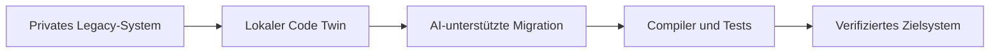
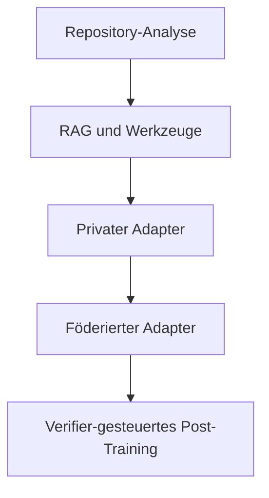

# Federated Coding für Legacy-Modernisierung

[Überblick](README.md) · [Architektur](../docs/de/architecture.md) · [Deployment](../docs/de/deployment.md) · [Workflow](../docs/de/workflow.md) · [Toolchain](../docs/de/toolchain.md) · [Governance](../docs/de/governance.md) · [English](../README.md)

> Unabhängige explorative Referenzarchitektur. Kein offizielles NVIDIA-Produkt, keine Rechtsberatung, keine Kundenimplementierung und keine Produktionsfreigabe.

**Präsentations-Site:** [ofunk-nvidia.github.io/FederatedCoding](https://ofunk-nvidia.github.io/FederatedCoding/)

## Die Idee für Executives

Geschäftskritische Logik liegt häufig in proprietären COBOL-, JCL-, PL/SQL-, Oracle-Forms- und verwandten Repositories. Allgemeine Coding-Assistenten kennen öffentliche Syntax und Muster, aber nicht die private Semantik, Abhängigkeiten, Ausnahmen und Betriebshistorie eines konkreten Kundensystems.

Dieses Konzept beschreibt eine kundenzentrierte AI-Coding-Umgebung, die Legacy-Software lokal versteht und modernisiert, ohne proprietären Quellcode in einen gemeinsamen Trainingskorpus zu verwandeln.

Das primäre Ziel ist eine verifizierte Migration, nicht Modelltraining. Repository-Verständnis, Retrieval, Transformationswerkzeuge, Compiler und Regressionstests kommen zuerst. Privates oder föderiertes Fine-Tuning wird nur ergänzt, wenn es einen messbaren Zusatznutzen liefert.

## Warum das relevant ist

| Executive-Frage | Antwort der Architektur |
|---|---|
| Proprietärer Quellcode | Code, Graphen, Embeddings und private Adapter bleiben lokal |
| Geringe Legacy-Abdeckung | Ein lokaler Code Twin und Retrieval liefern den Kundenkontext |
| Korrektheit der Migration | Compiler, Tests, statische Analyse und Human Review entscheiden über Releases |
| Wiederverwendbare Migrationsfähigkeit | Nur ausdrücklich freigegebene, abstrahierte Lernobjekte dürfen föderiert werden |
| Copyright- und Lizenzkontamination | Provenienz-, Ähnlichkeits-, Lizenz- und Leakage-Gates blockieren Releases |

## Kernthese

> Der Kunde darf sein eigenes System mit KI modernisieren. Daraus folgt nicht automatisch, dass Code, Geschäftslogik oder gelernte Modellbestandteile anderen Kunden zugutekommen dürfen.

Der gemeinsame Wert ist deshalb eine Migrationsfähigkeit und kein Gedächtnis für Kundencode.

## Inhalt dieses Repositories

- Local-first-Architektur für Legacy-Verständnis und Migration;
- gestufter Workflow von deterministischer Analyse bis zu optionalem föderiertem Lernen;
- Open-Source-orientierte NVIDIA-Toolchain für Fine-Tuning und Post-Training;
- Copyright-, Provenienz-, Leakage- und Verifikationskontrollen;
- GitHub-renderbares Markdown und Mermaid-Visuals.

Nicht enthalten sind Kunden-Repositories, Quellcode, Datensätze, Modellgewichte, Adapter, Checkpoints, ausführbare POCs, Produktivkonfigurationen oder Trainingsläufe.

## Fähigkeitsstufen

Eine Stufe wird nur fortgeführt, wenn sie die vorherige bei Migrationsqualität, Sicherheit, Provenienz und Kosten übertrifft.

## Empfohlene Navigation

1. [Architektur](../docs/de/architecture.md)
2. [Deployment](../docs/de/deployment.md)
3. [Workflow](../docs/de/workflow.md)
4. [Toolchain](../docs/de/toolchain.md)
5. [Governance](../docs/de/governance.md)

## Status

Das Konzept ist für Executive- und technische Gespräche vorbereitet. Der nächste mögliche Umsetzungsschritt ist ein synthetischer vertikaler Migrationsschnitt in einem getrennten privaten Repository. Dieses Repository führt keine Kundenprojekte aus.
