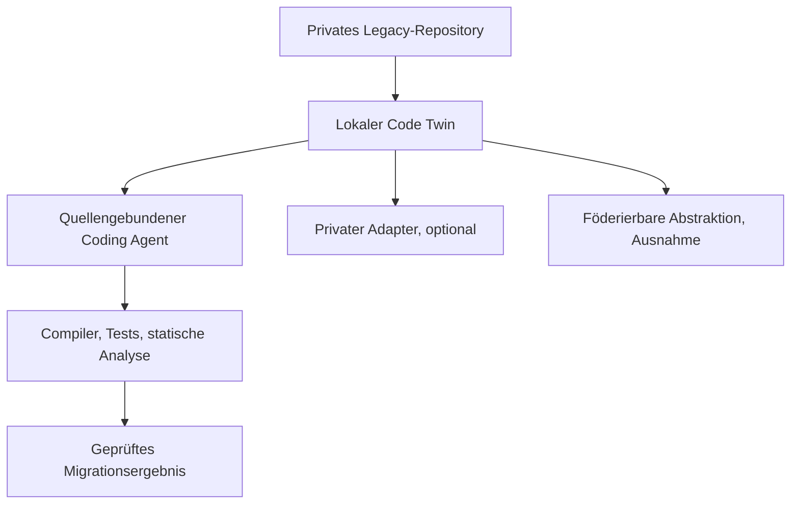

# Architektur

[Überblick](../../de/README.md) · [Architektur](architecture.md) · [Workflow](workflow.md) · [Toolchain](toolchain.md) · [Governance](governance.md) · [English](../en/architecture.md)

## Entwurfsziel

Eine kundenlokale Migrationsumgebung versteht proprietäre Software, erzeugt begrenzte Änderungen und verifiziert Verhalten, ohne Quellcode oder kundenspezifische Lernartefakte zu exportieren.

## Lokaler Code Twin

Der Code Twin ist die primäre Quelle des Kundenkontexts. Er verbindet:

- Repository-Inventar und Provenienz;
- Parser, ASTs, Symbol- und Aufrufgraphen;
- Schemas, Copybooks, Datenflüsse, Transaktionen und Batch-Abhängigkeiten;
- autorisierte Tests, Tickets, Dokumentation und Versionshistorie;
- explizite Unsicherheit bei nicht unterstützter Syntax oder fehlendem Verhalten.

Er bleibt innerhalb der Kundengrenze. Quelldateien, Chunks, Embeddings, Graphen, Identifier und Traces sind keine zentralen Lernobjekte.

## Modellebenen

| Ebene | Zweck | Grenze |
|---|---|---|
| Allgemeines Code-Modell | öffentliche Sprach- und Coding-Fähigkeit | identisches freigegebenes Modell je Site |
| Lokales Retrieval | Kontext des Kundensystems | nur Kunde |
| Privater Adapter | Kundenkonventionen und wiederkehrende lokale Muster | nur Kunde |
| Föderierter Migrationsadapter | freigegebene allgemeine Transformationsfähigkeit | nur geschützte Aggregation |
| Verifier | Compiler, Tests, Analyse und Policy Gates | lokale Release-Autorität |

## Legacy-spezifischer Entwurf

COBOL, JCL, PL/SQL und Oracle Forms benötigen unterschiedliche Parser und Verifikationsstrategien. Eine gemeinsame Zwischenrepräsentation kann sie verbinden, muss aber Kontrollfluss, Datenlayouts, Transaktionen, Seiteneffekte, Scheduling und UI-Trigger-Semantik erhalten. Migrationsqualität entscheidet sich an Verhaltensäquivalenz und nicht an syntaktischer Ähnlichkeit.

## Offene Architekturentscheidung

Für jeden Migrationsschnitt müssen Zielarchitektur, erforderliche Äquivalenz, zulässige Neugestaltung, maßgebliche Tests und Rechte zur Quellnutzung vor Generierung oder Training ausdrücklich entschieden werden.
