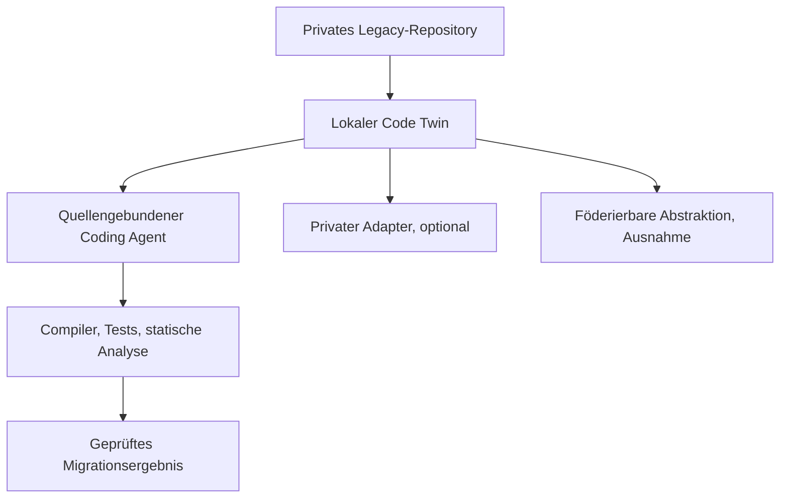
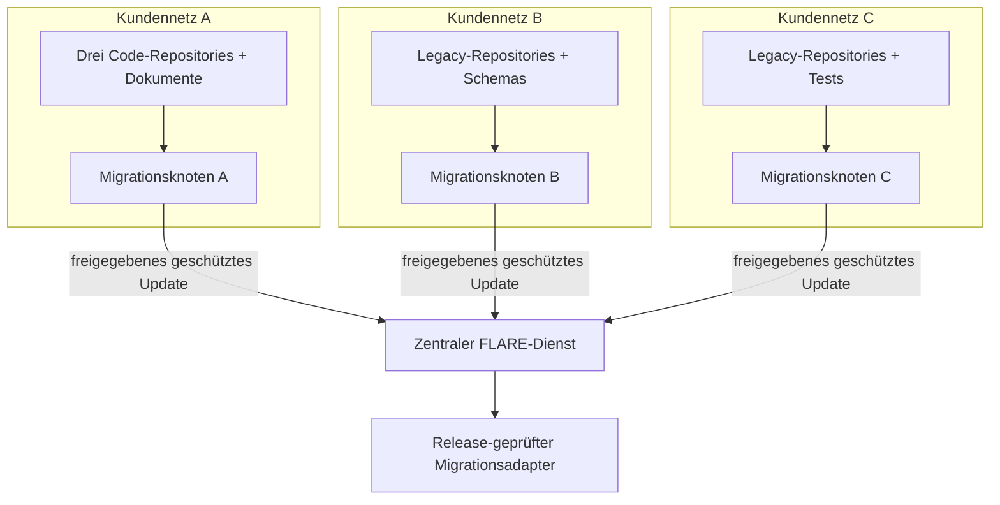

# Architektur

[Überblick](../../de/README.md) · [Architektur](architecture.md) · [Workflow](workflow.md) · [Toolchain](toolchain.md) · [Governance](governance.md) · [English](../en/architecture.md)

## Entwurfsziel

Eine kundenlokale Migrationsumgebung versteht proprietäre Software, erzeugt begrenzte Änderungen und verifiziert Verhalten, ohne Quellcode oder kundenspezifische Lernartefakte zu exportieren.

## Lokaler Code Twin

Der Code Twin ist die primäre Quelle des Kundenkontexts. Er verbindet:

- Repository-Inventar und Provenienz;
- Parser, ASTs, Symbol- und Aufrufgraphen;
- Schemas, Copybooks, Datenflüsse, Transaktionen und Batch-Abhängigkeiten;
- autorisierte Tests, Tickets, Dokumentation und Versionshistorie;
- explizite Unsicherheit bei nicht unterstützter Syntax oder fehlendem Verhalten.

Er bleibt innerhalb der Kundengrenze. Quelldateien, Chunks, Embeddings, Graphen, Identifier und Traces sind keine zentralen Lernobjekte.

## Quellenlandschaft und Ingestion-Verträge

Das lokale System muss eine Legacy-Landschaft als Sammlung kontrollierter Quellen behandeln und nicht als ein einzelnes Git-Repository.

| Quellentyp | Lokale Extraktion | Erforderliche Provenienz |
|---|---|---|
| Git, Subversion, Mainframe Libraries, File Shares | unveränderlicher Snapshot, Spracherkennung, Abhängigkeits- und Ownership-Inventar | System, Pfad, Revision, Erfassungszeit, Rechteentscheidung |
| COBOL, JCL, Copybooks, PL/SQL, Oracle-Forms-Exporte | parserspezifische Strukturen, Symbole sowie Call- und Data-Flow-Kanten | Parser/Version, Quellspanne, Parse-Konfidenz, ungelöste Konstrukte |
| PDF-, Word-, Wiki-, Ticket- und Runbook-Material | Text/OCR mit Seiten- oder Objektankern; nur Retrieval-Unterstützung, sofern nicht getrennt freigegeben | Quellen-ID, Version, Seiten-/Objektanker, Extraktionsmethode, Zugriffsentscheidung |
| Datenbankschemas und freigegebene Metadaten | Tabellen, Constraints, Prozeduren und Datenherkunft; standardmäßig keine Produktionszeilen | Exportmethode, Schemaversion, Umfang, Redaktionsentscheidung |
| Build-Skripte, Compiler, Tests und Runtime Traces | ausführbare Verifikationsumgebung und Verhaltensbeobachtungen | Toolchain-Version, Umgebung, Testidentität, Ergebnis und Zeitstempel |

Dokumentation ist Evidenz und keine ausführbare Wahrheit. Generierter Code wird gegen Parser, Compiler, Tests, Schema-Constraints und menschliches Review geprüft. Nicht unterstützte oder binäre Artefakte werden inventarisiert und quarantänisiert, statt stillschweigend ignoriert zu werden.

## Physische Bereitstellung: ein On-Premises-Migrationsknoten je Kunde

Kundenquellsysteme können häufig nicht in eine gemeinsame Cloud verschoben werden. Das Referenzmuster platziert deshalb einen gehärteten „Migrationsknoten“ neben jeder autorisierten Quellenlandschaft. Dies ist eine Architekturrolle, kein benanntes Produkt und keine Behauptung einer Appliance-Zertifizierung.

## Sicherheitszonen des Migrationsknotens

| Zone | Komponenten | Datenregel |
|---|---|---|
| Quellkonnektoren | read-only Repository Mirrors, File-Share-/PDF-Ingestion und Schema-Export-Adapter | nur ausdrücklich freigegebene Pfade und Revisionen einlesen |
| Analyse-Enklave | Parser, Codegraph, Retrieval-Index, Lineage Store und Policy-Klassifikator | alle Kunden-Identifier und abgeleiteten Darstellungen bleiben lokal |
| Trainings-Enklave | freigegebenes Basismodell, privater Adapter, optional föderierbarer Adapter und GPU-Runtime | private und exportfähige Datensätze und Checkpoints trennen |
| Verifikations-Enklave | Compiler, Datenbank-Sandbox, Test Harness und statische/Sicherheitsanalyse | keine generierte Änderung verlässt die Zone ohne deterministische und menschliche Gates |
| Austausch-Gateway | FLARE-Client, ausgehender Proxy, Update-Filter, Signierschlüssel und Quarantäne-Queue | nur zugelassene Job-Inputs und geschützte Lernoutputs überschreiten die Grenze |
| Evidenzspeicher | lokale Append-only-Logs, Manifeste, SBOMs, Freigaben und Testberichte | inhaltstragende Evidenz bleibt kundenlokal; zentrale Records verwenden Referenzen und Hashes |

Der Knoten sollte aus signierten, fixierten Images oder Paketen betrieben werden, nach Möglichkeit hardwaregeschützte Schlüssel verwenden, lokale Speicher verschlüsseln, Administratorrollen trennen, allgemeinen Internetzugriff deaktivieren und dem zentralen Betreiber keinen Repository-Dienst bereitstellen.

## Konnektivitätsprofile

FLARE wird nicht als Peer-Netzwerk zwischen Kunden behandelt. Clients verbinden sich normalerweise mit dem zentralen Server und direkte Ad-hoc-Verbindungen bleiben deaktiviert; NVIDIA beschreibt diese Standardtopologie in der [Communication Configuration](https://nvflare.readthedocs.io/en/main/user_guide/admin_guide/configurations/communication_configuration.html).

| Profil | Federation-Verhalten | Grenzkontrolle |
|---|---|---|
| Verbunden | der Migrationsknoten hält eine ausgehende authentifizierte und verschlüsselte Session zu festen FLARE-Endpunkten | Firewall-Allowlist, Proxy-Inspektions-Policy, gegenseitige Identität, Zertifikatsrotation, keine eingehende Route |
| Zeitweise verbunden | der Knoten öffnet ein freigegebenes Zeitfenster, empfängt einen signierten Job, arbeitet lokal und lädt anschließend ein geschütztes Update aus der Quarantäne hoch | Vier-Augen-Freigabe, Payload-Manifest, Hash-/Signaturprüfung, Timeout- und Replay-Schutz |
| Vollständig getrennt | keine Live-Federation; freigegebene Job- und Ergebnispakete durchlaufen einen organisationskontrollierten Transferprozess | Malware-Scan, Medienregister, Dual Control, kryptografische Prüfung und ausdrückliche Exportentscheidung |

Eine vollständig getrennte Site ist deshalb kein „Peer-to-Peer-FLARE“. Sie ist ein eigener kontrollierter Import-/Export-Workflow und erfüllt synchrone Aggregationsannahmen möglicherweise nicht. Der POC muss Dropout-, Retry-, Stale-Update- und Rollback-Verhalten für das gewählte Konnektivitätsprofil messen.

## Zentral sichtbare und kundenlokale Evidenz

Zentrale Evidenz darf Site-Pseudonym, Job- und Modellversion, signierten Update-Hash, Policy-Ergebnis, Kohortenteilnahme, Privacy-Parameter, aggregierte Metriken und Release-Entscheidung enthalten. Repository-URLs, Dateinamen, Quellfragmente, Prompts, Embeddings, Codegraphen, Compiler-Logs mit Code, private Adapter und detaillierte Migrationsergebnisse bleiben lokal. NVIDIA FLARE liefert PKI-, Federated-Authorization-, Site-Policy-, Privacy-Filter- und Audit-Bausteine; die Implementierung muss diese jedoch an Kundennetzkontrollen und Evidenzmodell binden. Siehe [FLARE Security](https://nvidia.github.io/NVFlare/security/).

## Modellebenen

| Ebene | Zweck | Grenze |
|---|---|---|
| Allgemeines Code-Modell | öffentliche Sprach- und Coding-Fähigkeit | identisches freigegebenes Modell je Site |
| Lokales Retrieval | Kontext des Kundensystems | nur Kunde |
| Privater Adapter | Kundenkonventionen und wiederkehrende lokale Muster | nur Kunde |
| Föderierter Migrationsadapter | freigegebene allgemeine Transformationsfähigkeit | nur geschützte Aggregation |
| Verifier | Compiler, Tests, Analyse und Policy Gates | lokale Release-Autorität |

## Legacy-spezifischer Entwurf

COBOL, JCL, PL/SQL und Oracle Forms benötigen unterschiedliche Parser und Verifikationsstrategien. Eine gemeinsame Zwischenrepräsentation kann sie verbinden, muss aber Kontrollfluss, Datenlayouts, Transaktionen, Seiteneffekte, Scheduling und UI-Trigger-Semantik erhalten. Migrationsqualität entscheidet sich an Verhaltensäquivalenz und nicht an syntaktischer Ähnlichkeit.

## Offene Architekturentscheidung

Für jeden Migrationsschnitt müssen Zielarchitektur, erforderliche Äquivalenz, zulässige Neugestaltung, maßgebliche Tests und Rechte zur Quellnutzung vor Generierung oder Training ausdrücklich entschieden werden.
