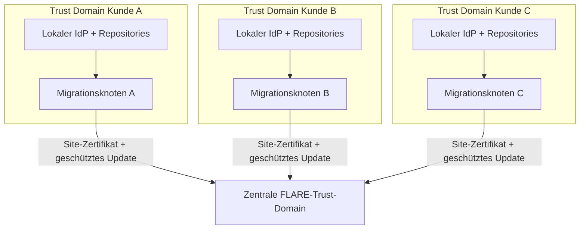
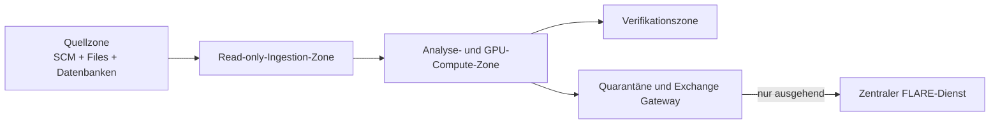

# Deployment-Design

[Überblick](../../de/README.md) · [Architektur](architecture.md) · [Deployment](deployment.md) · [Workflow](workflow.md) · [Toolchain](toolchain.md) · [Governance](governance.md) · [English](../en/deployment.md)

## Status und Umfang

Dies ist ein prüfbarer Low-Level-Referenzentwurf für einen synthetischen POC mit drei Kunden und einen möglichen Multi-Customer-Service. Er ist keine zertifizierte Appliance, Stückliste, Produktivkonfiguration oder Erlaubnis zur Verbindung mit einem Kundennetz. Exakte Hardware, Betriebssysteme, Modelle, Endpunkte und Kontrollen benötigen Kundenfreigabe und Benchmarks in einem getrennten privaten Implementierungs-Repository.

## Organisationsübergreifendes Vertrauensmodell

Anders als im zentral gehosteten Consulting Use Case gehört jede Legacy-Landschaft einer anderen Kundenorganisation und Identitätsdomäne. Kunde A kann Active Directory, Kunde B Entra ID und Kunde C LDAP oder Mainframe RACF verwenden. Diese Identity Provider werden nicht zusammengeführt und müssen dem zentralen Betreiber nicht vertrauen.

Lokaler Repository-Zugriff wird ausschließlich durch kundeneigene Identitäten authentifiziert, die innerhalb der Credential-Grenze des Kunden gespeichert sind. Der zentrale Dienst sieht nur die FLARE-Site-Identität. FLARE-PKI stellt die Federation Identity bereit; sie darf keine Brücke schaffen, über die sich der zentrale Betreiber an einem Repository oder Kunden-IdP authentifizieren kann.

| Identität | Aussteller | Gültig bei | Niemals gültig bei |
|---|---|---|---|
| Repository Service Account | Kunden-IdP | ausdrücklich freigegebene lokale Repositories | FLARE-Hub oder anderer Kunde |
| Migrationsknoten-Administrator | Kunden-IdP | lokale Management Plane | zentrale Modelladministration, sofern nicht getrennt zugewiesen |
| FLARE-Site-Zertifikat | Federation CA | FLARE-Kanal Client zu Server | Repository, Datenbank oder Human Login |
| Federation-Operator-Identität | IdP des zentralen Betreibers | Jobfreigabe und zentraler FLARE-Betrieb | Kunden-Repositories und lokaler Evidenzspeicher |
| Artefakt-Signer | kontrollierter Build-Dienst | Prüfung von Image-, Job- und Modellsignaturen | interaktiver Zugriff |

## Physisches Muster des Migrationsknotens

Die fünf Zonen können VLANs, virtuelle Netze, VM Security Groups, Kubernetes Network Policies oder eine Kombination sein. Ein einzelner physischer Server kann sie für einen synthetischen POC aufnehmen. Produktive Sicherheit beruht jedoch auf unabhängigen Credentials, Filesystemen, Prozessisolation, Routingkontrollen und Audit Logs und nicht auf Bezeichnungen allein.

## Referenzrahmen für Hardware

| Profil | CPU und Speicher | GPU | Lokaler Speicher | Netzwerk | Zweck |
|---|---|---|---|---|---|
| Inventory Node | 16–32 Cores, 128 GB RAM | keine | 2–4 TB verschlüsselte Enterprise SSD | 1/10 GbE | Repository-Inventar, Parsing, Graphen und RAG |
| Migrations-POC | 32–64 Cores, 256–512 GB RAM | 1 GPU mit 48–80 GB VRAM | 4–8 TB gespiegelte NVMe plus Backup-Ziel | 10 GbE | lokale Inferenz der 7B–14B-Klasse und LoRA-Experimente |
| Größerer Pilot | 64–128 Cores, 512 GB–1 TB RAM | 2–4 freigegebene GPUs mit je 48–80 GB VRAM | 8–20 TB resiliente NVMe | 10/25 GbE | größerer Kontext, paralleles Parsing, Evaluation und kontrolliertes Training |

Vorzusehen sind TPM 2.0 oder ein freigegebener Hardware Key Store, Secure Boot soweit unterstützt, redundante Stromversorgung, Out-of-Band-Management in einem getrennten Administrationsnetz und verschlüsseltes Backup. Die GPU-Anzahl ergibt sich aus gemessenem Modellbedarf, Kontextlänge, Quantisierung, Adapterrang und Parallelität. Keine Modellgrößenangabe ist eine Beschaffungsgarantie.

## Referenzzuordnung der Software

| Ebene | Kandidat | Deployment-Regel |
|---|---|---|
| Host | unterstützte gehärtete Linux-Distribution | minimale Pakete, Full-Disk Encryption und gemessene Patch-Baseline |
| Container | containerd/Kubernetes oder Rootless-Podman-/Docker-Muster | signierte, per Digest fixierte Images; getrennte FLARE-Parent- und Job-Images |
| GPU-Runtime | freigegebener NVIDIA-Treiber und Container Toolkit | Versionskompatibilitätsmatrix je Release dokumentieren |
| Quell-Ingestion | vom Kunden freigegebene read-only Connector-Prozesse | eine Credential und Allowlist je Quelle; kein zentraler Callback |
| Code Twin | Sprachparser, PostgreSQL/pgvector sowie Graph-/Index-Komponenten | kundenlokaler Namespace und Verschlüsselungsschlüssel |
| Training | freigegebenes Basismodell, PEFT-/LoRA-Runtime und FLARE-Client | private und exportfähige Workspaces physisch oder kryptografisch trennen |
| Verifikation | Compiler, Datenbank-Sandbox, Test Harness und statische/Sicherheitsanalyse | kein Netzwerkpfad zu produktiven Schreibendpunkten |
| Evidenz | lokaler Append-only-Log- und Manifest-Store | Detailevidenz lokal; signierte Zusammenfassung exportieren |

Open-Weight-Modelle, proprietäre Compiler und Kundendatenbankprodukte benötigen unabhängige Bedingungen und Freigaben, auch wenn die Orchestrierungssoftware Open Source ist.

## Matrix der Quellkonnektoren

Nur die für den freigegebenen Umfang erforderlichen Zeilen werden aktiviert.

| Quelle | Typisches Protokoll/Port | Minimaler Zugriff | Lokale Erfassung |
|---|---:|---|---|
| Git über HTTPS | TCP 443 | read für ein Repository/einen Ref | commit-adressierter Mirror und Manifest |
| Git über SSH | TCP 22 | read-only Deploy Key | commit-adressierter Mirror und Manifest |
| Subversion | TCP 443 oder 3690 | read für ausgewählte Pfade/Revisionen | unveränderlicher Export plus Revisionsmetadaten |
| SMB File Share | TCP 445 | read für ausgewählte Verzeichnisse | gehashter Snapshot mit ACL-/Provenienzrecord |
| NFS | TCP 2049 plus umgebungsspezifische RPC-Regeln | Read-only Export | gehashter Snapshot mit Mount-/Exportidentität |
| z/OS Transfer Gateway | kundendefinierter SFTP-/Managed-Transfer-Port | read für freigegebene Libraries/Members | EBCDIC-fähiger Snapshot und Transfermanifest |
| Oracle-Metadaten | TCP 1521 oder kundendefinierter Listener | Katalog-/Schemametadaten; kein Production DML | Schema-DDL, Objekt-IDs und Extraktionslog |
| PDF-/Word-/Datei-Repository | quellenspezifisches Leseprotokoll | nur ausgewählte Dokumente | Originalhash, extrahierter Text/OCR sowie Seiten-/Objektanker |

Dies sind übliche Protokollstandards und keine pauschalen Firewall-Anforderungen. Der Kundennetzverantwortliche liefert die finalen Endpunkte und kann Direktzugriff durch einen gestagten, freigegebenen Export ersetzen. Produktionsdatenzeilen, Credentials im Quellcode, Binärdateien und nicht unterstützte Dateien werden durch Policy quarantänisiert.

## Federation- und Infrastrukturports

| Quelle | Ziel | Protokoll/Port | Richtung und Kontrolle |
|---|---|---:|---|
| Migrationsknoten | Kunden-DNS | UDP/TCP 53 | nur lokale Infrastruktur |
| Migrationsknoten | Kunden-Zeitquelle | UDP 123 | nur lokale vertrauenswürdige Zeit |
| Exchange Gateway | zentraler FLARE-Endpunkt | fixer provisionierter TCP-Port, POC-Kandidat 8002 | ausgehende Session; Firewall-Ziel-Allowlist und mTLS |
| freigegebener Operations Runner | zentraler FLARE-Administrationsendpunkt | separat provisionierter fixer TCP-Port, POC-Kandidat 8003 | nur zentrales Betriebsnetz |
| Migrationsknoten | kundengesteuerte Registry oder Update Mirror | TCP 443 | per Digest fixierte Images und signierte Updates |
| Migrationsknoten | Kunden-SIEM-Collector | TCP 443 oder freigegebener Collector-Port | Security- und Health-Events |

Es gibt keine eingehende Route vom Hub zum Migrationsknoten und keine Route zwischen Kunden. Direkte FLARE-Ad-hoc-Verbindungen werden deaktiviert. Hostnamen und Ports werden bei der Provisionierung fixiert und an Site-Zertifikate und Firewall-Regeln gebunden. NVIDIA dokumentiert serververbundene Clients als Backbone-Topologie und verlangt, dass provisionierte Hostnamen und Ports zur Netzwerkkonfiguration passen. Siehe [Communication Configuration](https://nvflare.readthedocs.io/en/main/user_guide/admin_guide/configurations/communication_configuration.html) und [Deployment Overview](https://nvflare.readthedocs.io/en/main/user_guide/admin_guide/deployment/overview.html).

## Verbundener, zeitweiser und getrennter Betrieb

| Modus | Jobbereitstellung | Ergebnisfreigabe | Auswirkung auf Federation |
|---|---|---|---|
| Verbunden | vorinstallierter signierter Job wird über FLARE ausgewählt | gefiltertes geschütztes Update in aktiver Runde gesendet | normale Hub-and-Spoke-Runde mit Timeout und Kohorten-Policy |
| Zeitweise verbunden | signiertes Paket im freigegebenen Zeitfenster geladen und quarantänisiert | Vier-Augen-Freigabe gibt signiertes Updatepaket in späterem Fenster frei | Async-/Stale-Update-Policy erforderlich; Server verwirft abgelaufene Round IDs |
| Vollständig getrennt | kontrolliertes Wechselmedium oder Kundentransferstation | kontrollierter Export über denselben Kanal | keine Live-FLARE-Session; separater Batch-Aggregationsprozess und ausdrückliche Exportentscheidung |

„Offline“ ist keine Peer-to-Peer-Federation. Eine vollständig getrennte Site ist ein kontrollierter Paketaustausch und wird getrennt von den Connected-Runtime-Annahmen von FLARE bewertet.

## Lebenszyklus von Zertifikaten und Artefakten

1. Federation Security genehmigt Projektmanifest, Organisationen, Site-Namen und feste Endpunkte.
2. Eine kontrollierte Provisionierungszeremonie erzeugt signierte Startup Kits und eindeutige Teilnehmer-Credentials.
3. Der Organisationsadministrator jedes Kunden erhält ausschließlich sein eigenes Kit über einen authentifizierten Kanal und prüft dessen Hash.
4. Der private Site-Schlüssel wird in den lokalen geschützten Store importiert und niemals an den zentralen Betreiber zurückgegeben.
5. Parent- und Job-Images, Policies, Parser Packs und Modellmanifeste werden signiert und per Digest zugelassen.
6. Kompromittierung führt zu Site-Widerruf, Firewall-Sperre, Kit-Austausch und Ausschluss von Updates nach der letzten vertrauenswürdigen Runde.
7. Getrennte Sites erhalten bei jedem freigegebenen Paketaustausch ein aktualisiertes Trust- und Revocation-Bundle.

FLARE dokumentiert Teilnehmer-Startup-Kits, signierte Inhalte, PKI-Identitäten und site-kontrollierte Policies. Siehe [FLARE Provisioning and Deployment](https://nvflare.readthedocs.io/en/main/user_guide/admin_guide/deployment/overview.html) und [FLARE Security](https://nvidia.github.io/NVFlare/security/).

## Daten- und Update-Release-Contract

Das Exchange Gateway implementiert ein Positivschema: Job-ID, Round-ID, Basismodell-Digest, Adapterschema, deklarierte Tensoren, Clipping-Ergebnis, Privacy-Metadaten, aggregationssichere Metriken, Update-Hash und Site-Signatur. Alles nicht Deklarierte wird abgelehnt. Dateinamen, Repository-URLs, Symbole, Quellspannen, Prompts, abgerufene Chunks, Embeddings, Graphen, Compileroutput mit Code, private Checkpoints und Credentials sind zentral verboten.

Transportverschlüsselung entscheidet nicht, ob ein Update zulässig ist. Rechteklassifikation, Update-Inspektion, Clipping-/Privacy-Kontrollen, Mindestkohorte, Leakage-Tests und vom Kunden genehmigter Wiederverwendungszweck bleiben Release-Bedingungen.

## Betriebs- und Evidenzverantwortung

| Verantwortung | Kundenorganisation | Zentraler Federation Operator |
|---|---:|---:|
| Repository-Rechte und Credentials | verantwortlich | kein Zugriff |
| lokale Node-Härtung und Patchfenster | verantwortlich/freigebend | liefert signierte Baseline |
| lokales Quellenmanifest und detaillierte Trainingsherkunft | bewahrt auf | erhält nur signierte Referenz/Hash |
| FLARE-CA und Serverbetrieb | prüft Trust-Bedingungen | verantwortlich |
| Job- und Modellrelease | lokale Akzeptanz erforderlich | bereitet Kandidat vor und signiert |
| Update-Export | ausdrückliche lokale Policy-Entscheidung | kann nicht übersteuern |
| Aggregatevaluation und gemeinsames Release | konsultiert | mit Model-Risk-Freigabe verantwortlich |
| Incident Containment | sperrt lokale Routen und Identität | widerruft Site und Runden, koordiniert Evidenz |

Jeder Run erzeugt ein lokales Evidenzpaket mit Quellen-Snapshot-IDs, Zugriffsentscheidung, Parserabdeckung, Dataset Split, Tool-/Model-/Image-Digests, SBOM, Policy-Version, Testergebnissen, Exportentscheidung und Aufbewahrungsfrist. Das zentrale Paket enthält Site-Pseudonym, signierte Referenzen und Hashes, Runden-/Kohortenevidenz, Privacy-Einstellungen, aggregierte Metriken, Release-Freigaben und Deploymentstatus.

## Verfügbarkeit, Backup und Recovery

Repository Mirrors und abgeleitete Indizes sind aus freigegebenen Snapshots reproduzierbar; private Adapter, Testevidenz und Manifeste benötigen verschlüsseltes lokales Backup. Der zentrale Dienst sichert signierte Konfiguration, aggregierten Zustand, Audit Records und freigegebene Adapter. Er sichert niemals Kundencode. Der POC testet Node-Rebuild, Zertifikatswiderruf, Teilausfall einer Runde, Ablehnung veralteter Updates, Quarantäne beschädigter Pakete und Wiederherstellung ohne Cross-Customer-Inhalte.

Produktive zentrale Hochverfügbarkeit muss der vom exakt fixierten FLARE-Release unterstützten Topologie folgen. Generische Replikation eines zustandsbehafteten Koordinators wird ohne Failover-Test nicht akzeptiert.

## Implementierungsfolge und Abnahme

1. Drei synthetische Landschaften für Git/COBOL-, PL/SQL-/Schema- und Oracle-Forms-/PDF-Inputs erstellen.
2. Je synthetischem Kunden einen Migrationsknoten mit unterschiedlicher lokaler IdP-Simulation deployen.
3. Nachweisen, dass der Hub weder Credential noch Route zu einem Quellsystem besitzt.
4. Eindeutige FLARE-Site-Kits und feste ausschließlich ausgehende Netzwerkpfade provisionieren.
5. Inventar, Parsing, RAG und Verifikation lokal ausführen, bevor Training aktiviert wird.
6. Private LoRA und anschließend einen getrennt klassifizierten föderierten Adapter mit Canary-Material ausführen.
7. Verbundene, zeitweise verbundene und kontrollierte getrennte Transfers erproben.
8. Bösartige Jobs, nicht deklarierte Felder, Replay, veraltete Updates, Route Escape und Memorisation red-teamen.
9. Compute, Storage, Netzwerk, Recovery und Betriebsaufwand benchmarken.
10. Vor einem Piloten mit echtem Code eine gemeinsame Risk Acceptance von Kunde und zentralem Betreiber erstellen.

Die Abnahme verlangt null zentralen Repository-Zugriff, null Kunden-zu-Kunden-Routen, reproduzierbare lokale Provenienz, schema-begrenzte Exporte, erfolgreichen Widerruf und Recovery, verifiziertes Migrationsverhalten sowie dokumentiertes verbleibendes Copyright- und Privacy-Risiko.
