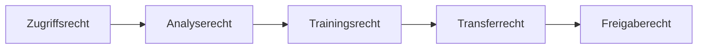

# Governance

[Überblick](../../de/README.md) · [Architektur](architecture.md) · [Workflow](workflow.md) · [Toolchain](toolchain.md) · [Governance](governance.md) · [English](../en/governance.md)

## Leitprinzip

Technischer Zugriff auf ein Repository begründet nicht automatisch das Recht zur Analyse, zum Training, zur Erzeugung abgeleiteter Werke, zur Übertragung von Lernsignalen oder zur Wiederverwendung für andere Kunden. Das sind getrennte Entscheidungen.

## Artefaktklassen

| Klasse | Beispiel | Standardbehandlung |
|---|---|---|
| Offen und kompatibel | verifizierte permissiv lizenzierte Beispiele | POC-Nutzung nach Provenienzprüfung |
| Kundenlokal | proprietärer Code und Dokumentation | nur lokale Analyse und RAG |
| Kundenlokales Training | ausdrücklich freigegebene Beispiele | nur privater Adapter |
| Föderierbare Abstraktion | freigegebenes synthetisches oder abstraktes Muster | geschützte Aggregation nach Leakage-Prüfung |
| Unbekannt oder verboten | unklare Rechte, Vendor Code, Secrets | ablehnen und quarantänisieren |

## Erforderliche Kontrollen

- Provenienz auf Repository- und Commit-Ebene;
- Scans für Lizenzen, Copyright Header, Secrets und Drittcode;
- Trennung von generiertem, Vendor-, Test- und First-Party-Code;
- Ähnlichkeits- und Clone-Erkennung für Outputs;
- Compiler-, Regressions-, Security- und Datenäquivalenztests;
- private Behandlung von Prompts, Traces, Rewards, Embeddings und Adaptern;
- menschliche Freigabe der Migrationsbedeutung und nicht nur der Syntax;
- Rückruf- und Löschverfahren für abgeleitete Artefakte.

## Release Gate

Generierter Code wird nicht allein deshalb freigegeben, weil er kompiliert. Er benötigt Verhaltenstests, Security- und Lizenzprüfung, Provenienzreview, Ähnlichkeitsschwellen und verantwortliche menschliche Freigabe. Ein föderierter Adapter benötigt zusätzlich Cross-Customer-Leakage-Tests und eine ausdrückliche vertragliche Grundlage.

## Veröffentlichung des Repositories

Dieses öffentliche Repository enthält ausschließlich Beschreibungen. Die [Veröffentlichungs-Policy](../../de/PUBLICATION_POLICY.md) regelt die Inhaltsaufnahme, die [Open-Source-Werkzeugbasis](../../de/OPEN_SOURCE_BASELINE.md) Werkzeugangaben und das automatische Publication Gate einen Mindestscan. Human Review bleibt verpflichtend.
