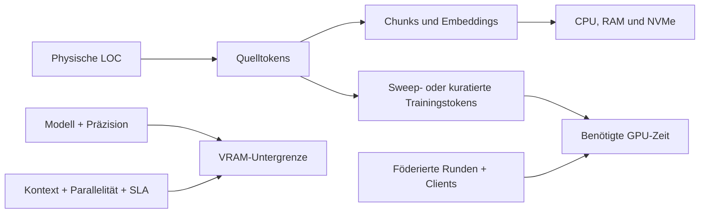

# Sizing- und Performance-Modell

[Überblick](../../de/README.md) · [Architektur](architecture.md) · [Deployment](deployment.md) · [Sizing](sizing.md) · [Workflow](workflow.md) · [Toolchain](toolchain.md) · [Governance](governance.md) · [English](../en/sizing.md)

## Entscheidung in Kürze

Lines of Code dimensionieren die Quellanalyse, bestimmen aber nicht allein die GPU-Anzahl. CPU, RAM und Speicher richten sich nach Repositories, Sprachen, Historie, generierten Artefakten und Graphkomplexität. GPU-Kapazität folgt Modellgröße, Präzision, Kontextlänge, Parallelität, Latenzziel, Trainingsmethode sowie Anzahl der Evaluations- oder föderierten Runden.

Diese ersten Rahmen sind Benchmark-Hypothesen und keine Stückliste oder Beschaffungsgarantie. Ein synthetischer repräsentativer Ausschnitt muss sie validieren, bevor Kundencode verwendet wird.



## Was Post-Training ist und was nicht

| Aktivität | Ändern sich Gewichte? | Kapazitätstreiber |
|---|---:|---|
| Inventar, Parsing, Graphen und Code Twin | nein | Dateien, Sprachen, CPU, RAM und Speicher |
| lokales Retrieval und Tool Use | nein | Kontext, Parallelität und Input-/Prefill-Durchsatz |
| privates SFT oder LoRA/PEFT | ja | kuratierte Tokens, Epochen, Modell, Präzision und VRAM |
| föderiertes Adaptertraining | ja | lokaler Trainingsaufwand je Runde plus Clients und Runden |
| Preference- oder Verifier-gesteuertes RL | ja | Rollouts, Verifier-Kosten und Evaluation |

Privates Fine-Tuning und föderiertes Adaptertraining sind im breiten technischen Sinn beide Post-Training. Preference oder RL ist eine spätere, spezialisierte Post-Training-Stufe. Code über Retrieval zu lesen ist kein Training.

## Transparente LOC-Umrechnung

Physische LOC sind nur ein Inventarmaß. Leerzeilen, generierter Code, Copybooks, SQL, minifizierte Dateien und Sprachmix verhindern einen universellen Faktor. Bis der gewählte Tokenizer die Repositories vermessen hat, gelten 6–20 Modelltokens je physischer LOC mit 10 als Planungsmittelwert. Angenommen werden 512-Token-Chunks bei etwa 12% Überlappung, ungefähr 450 neue Tokens je Chunk, sowie 8 KiB für Vektor und Metadaten vor Replikaten und Backups.

```text
quelltokens = physische_LOC × gemessene_tokens_je_LOC
chunks = quelltokens / (chunk_tokens × (1 - überlappung))
sweep_sekunden = quelltokens × durchläufe / gemessene_effektive_input_tokens_je_sekunde
trainingstokens = quelltokens × freigegebener_kuratierter_anteil × epochen
```

| Bestand | Tokenbereich bei 6–20/LOC | Mittelwert | Ungefähre Chunks | Vektor + Metadaten |
|---:|---:|---:|---:|---:|
| 1 MLOC | 6–20 Mio. | 10 Mio. | 22.000 | 0,2 GiB |
| 10 MLOC | 60–200 Mio. | 100 Mio. | 222.000 | 1,7 GiB |
| 20 MLOC | 120–400 Mio. | 200 Mio. | 444.000 | 3,4 GiB |
| 50 MLOC | 300 Mio.–1 Mrd. | 500 Mio. | 1.111.000 | 8,5 GiB |

Der Vektorspeicher ist nicht die dominante Reservierung. Mirrors und Historie, ASTs und Graphen, Zwischenrepräsentationen, Build-Artefakte, Tests, Compiler-Sandboxes, Evidenz, Headroom für Neuaufbau und verschlüsselte Backups sind üblicherweise größer.

## Erste Rahmen für den Kundenknoten

Diese Bandbreiten unterstellen einen gemischten Legacy-Bestand, lokale Inferenz der 7B–14B-Klasse, optionale LoRA-Experimente und reproduzierbare Indizes.

| Bestand | Analyse und Verifikation | Arbeitsspeicherplatz | GPU-Benchmark-Start | Betriebsmuster |
|---:|---|---:|---|---|
| 1 MLOC | 16–32 Cores, 128–256 GB RAM | 1–2 TB NVMe | optional 1 × 48 GB | enger Ausschnitt; serielle Evaluation |
| 10 MLOC | 32–64 Cores, 256–512 GB RAM | 2–4 TB NVMe | 1 × 48–80 GB | mehrere Repositories; geplanter Refresh |
| 20 MLOC | 64–96 Cores, 512–768 GB RAM | 4–8 TB NVMe | 1 × 80–141 GB oder 2 × 48–80 GB | paralleles Parsing, Retrieval und Evaluation |
| 50 MLOC | 96–192 Cores, 768 GB–1,5 TB RAM | 8–20 TB NVMe | 2–4 × 80–141 GB | partitionierte Indizes und Trainingsfenster |

Die GPU-Spalte ist ein Benchmark-Startpunkt und keine Folge der LOC. 20 MLOC mit kleinem Modell und niedriger Parallelität können eine 48-GB-GPU verwenden; 1 MLOC mit 70B-Modell, langen Kontexten und hoher Parallelität können mehrere benötigen. NVIDIA veröffentlicht 48 GB für [L40S](https://www.nvidia.com/en-us/data-center/l40s/), 80 GB für [H100 SXM](https://www.nvidia.com/en-eu/data-center/h100/) und 141 GB für [H200-Konfigurationen](https://docs.nvidia.com/enterprise-reference-architectures/whitepaper/hgx-servers-and-spectrum-x.pdf). Runtime, Aktivierungen, Buffer und KV Cache reduzieren die nutzbare Modellkapazität.

## Sizing nach Systemrolle

| Systemrolle | Skaliert mit | Erste Auslegung |
|---|---|---|
| Quellkonnektoren | Repositories und Änderungsrate | 4–16 Cores, 16–64 GB RAM je Pool; keine GPU |
| Parser-/Code-Twin-Worker | LOC, Sprachen und Graphkanten | Analyserahmen horizontal partitionieren |
| Index/Datenbank | Chunks, Metadaten, Parallelität und Replikate | RAM für heiße Indizes plus mindestens 30% Neuaufbau-Headroom |
| GPU-Inferenz/Training | Modell, Präzision, Kontext, Batch und SLA | 48-/80-/141-GB-Klassen benchmarken; Trainingsfenster isolieren |
| Verifikations-Worker | Compiler, Builds und Testparallelität | getrennte CPU-/RAM-Pools nach Clean-Build- und Regressionszeit |
| Customer Exchange Gateway | Updates und Policy-Prüfungen, nicht LOC | 4–8 Cores, 16–32 GB RAM, 100–250 GB; keine GPU |
| zentraler FLARE-Dienst | Clients, Runden, Adaptergröße und Aufbewahrung | 8–16 Cores, 32–64 GB RAM, resiliente 0,5–2 TB; GPU nur für freigegebene Evaluation |

## Durchgerechnetes Beispiel mit 20 MLOC

Bei 10 Tokens/LOC entsprechen 20 MLOC etwa 200 Millionen Quelltokens und 444.000 Chunks. Ein vollständiger modellgestützter Sweep dauert bei 5.000 effektiven Input-Tokens/s etwa 11,1 Stunden, bei 20.000 etwa 2,8 Stunden und bei 50.000 etwa 1,1 Stunden. Das sind zu messende Szenarien, keine GPU-Zusagen; das Resultat wird mit den Durchläufen multipliziert und durch die beobachtete Auslastung geteilt.

Im Onlinepfad werden nicht bei jeder Frage alle 200 Millionen Tokens gesendet. Das System lädt einen begrenzten Kontext, beispielsweise 8.000–32.000 Input-Tokens. Ein Sweep über den Gesamtbestand ist ein Offline-Batchjob.

Werden 2% zu einem ausdrücklich freigegebenen kuratierten Satz und LoRA läuft drei Epochen, entstehen 12 Millionen präsentierte Trainingstokens:

```text
200 Mio. × 0,02 × 3 = 12 Mio. Trainingstokens
```

Federation beseitigt den lokalen Rechenaufwand nicht. Jeder teilnehmende Client trainiert und evaluiert in jeder Runde. Der Hub aggregiert zulässige Updates; er trainiert nicht auf einem zusammengeführten Kunden-Quellkorpus.

## NVIDIA-Werte für Tokens/s einordnen

Veröffentlichte Werte sind nur bei gleichem Modell, GPU, Präzision, Parallelismus, Input-/Outputlängen, Concurrency, Softwarestand und Latenzziel vergleichbar. NVIDIAs am 13. September 2026 geprüfte TensorRT-LLM-Übersicht weist ausdrücklich **Output**-Tokens/s/GPU aus und schließt Input-Tokens aus. Dort verändert sich eine GPT-OSS-120B-H200-Konfiguration von 6.868 Output-Tokens/s/GPU bei ISL/OSL 1.000/1.000 auf 519 bei 32.768/1.024. Eine Tokens/s-Headline kann daher Code-Ingestion nicht dimensionieren. Siehe [TensorRT-LLM Performance Overview](https://github.com/NVIDIA/TensorRT-LLM/blob/main/docs/source/developer-guide/perf-overview.md).

Der Benchmark muss Ingestion in MB/s und LOC/s, Parserfehler, Embedding-Chunks/s, effektive Input-/Prefill-Tokens/s, Request-Durchsatz, Time to First Token, Inter-Token Latency, Output-Tokens/s, Spitzenwerte für VRAM/RAM/IOPS, Index-Neuaufbau, LoRA-/Checkpoint-Zeit, Federation-Zeit je Runde, Updategröße, Compiler-/Testpfad sowie Qualität, Leakage und Äquivalenz erfassen.

NVIDIA trennt Latenz- und Durchsatzmetriken in den [Grundlagen für Inferenz-Benchmarks](https://developer.nvidia.com/blog/llm-inference-benchmarking-fundamental-concepts/) und dokumentiert Workload Sweeps mit [GenAI-Perf](https://developer.nvidia.com/blog/llm-inference-benchmarking-guide-nvidia-genai-perf-and-nim/). Der POC muss repräsentative Code-Prompts mit der exakt freigegebenen Open-Source-Runtime abspielen. NIM-Werte dürfen den Vergleich informieren, machen NIM aber nicht zum Teil der strikten Open-Source-Baseline.

## Exit Gate für die Beschaffung

Die Beschaffungsgrundlage ist erst bereit, wenn ein synthetischer Benchmark exaktes Modell und Lizenz, Tokenizer-Verteilung je Sprache, ISL-/OSL-Perzentile, Parallelität und Latenz-SLO, Qualitätsziel, Index-/Buildzeiten, Post-Training-Zeitplan, Ausfallreserve, Strom-/Kühlungsgrenzen und Messergebnisse auf dem Kandidatensystem dokumentiert.
