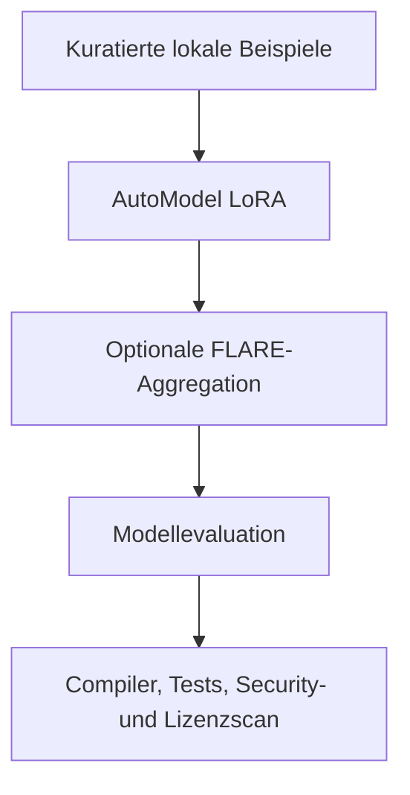

# Toolchain

[Überblick](../../de/README.md) · [Architektur](architecture.md) · [Workflow](workflow.md) · [Toolchain](toolchain.md) · [Governance](governance.md) · [English](../en/toolchain.md)

## Empfohlener Open-Source-orientierter Stack

| Ebene | Kandidat | Rolle | Einordnung |
|---|---|---|---|
| Code-Aufbereitung | NeMo Curator plus code-spezifische Filter | Provenienz, Deduplizierung, Decontamination | gezielter lokaler Einsatz |
| Fine-Tuning | NeMo AutoModel | lokales SFT und LoRA/PEFT | bevorzugte Trainingsschicht |
| Federation | NVIDIA FLARE | Policy-gesteuerte Adapteraggregation | optional nach lokalem Nachweis |
| Evaluation | NeMo Evaluator plus Compiler und Tests | reproduzierbare Qualitätsprüfung | verpflichtende kombinierte Evidenz |
| Post-Training | NeMo RL | Preference- oder Verifier-gesteuertes Lernen | nur spätere Stufe |
| Skalierung | NeMo Framework / Megatron Core | großes oder verteiltes Training | nur bei gemessenem Bedarf |
| Inferenz | TensorRT-LLM | optionale lokale Optimierung | nach Modellvalidierung |

Vor einer Implementierung sind konkretes Release, Repository-Lizenz, enthaltene Abhängigkeiten, Container-Bedingungen, Basismodell-Lizenz und Parser-Lizenzen zu prüfen. Siehe [Open-Source-Werkzeugbasis](../../de/OPEN_SOURCE_BASELINE.md).

NVIDIA NIM und NeMo Microservices liegen außerhalb der strikten Open-Source-Baseline und benötigen eine getrennte Produktentscheidung.

## Verifikationswerkzeuge bleiben maßgeblich

Bei Code-Migration genügt kein Modellscore. Kompilierung, Verhaltenstests, Datenvergleich, statische Analyse, Sicherheitsprüfungen, Ähnlichkeitserkennung und Human Review bestimmen die Release-Eignung.
