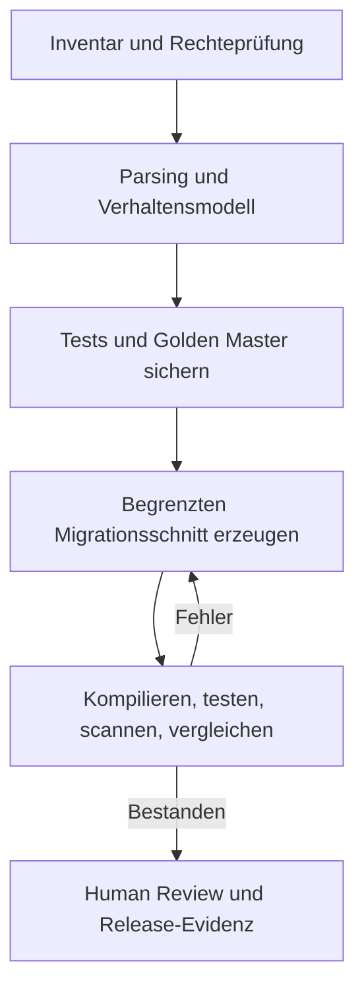

# Workflow

[Überblick](../../de/README.md) · [Architektur](architecture.md) · [Deployment](deployment.md) · [Sizing](sizing.md) · [Workflow](workflow.md) · [Toolchain](toolchain.md) · [Governance](governance.md) · [English](../en/workflow.md)

## Migrationslebenszyklus

## Fähigkeitsstufen

| Stufe | Fähigkeit | Beförderungskriterium |
|---|---|---|
| 0 | deterministisches Inventar, Parsing und Graphen | Abdeckung und Korrektheit |
| 1 | lokales RAG und Tool Use | quellengebundene Antworten und begrenzte Änderungen |
| 2 | privates LoRA-Adapter-Post-Training | messbarer Gewinn gegenüber RAG-only |
| 3 | föderiertes Adapter-Post-Training | Cross-Site-Gewinn ohne verbotenes Leakage |
| 4 | Preference- oder RL-basiertes Post-Training | robuster Verifier und Anti-Gaming-Evidenz |

Die Stufen 2–4 sind sämtlich Formen von Post-Training, weil sie Adapter- oder Modellgewichte verändern. Die Stufen 0–1 analysieren oder laden Code, ohne Gewichte zu verändern. Das [Sizing](sizing.md) trennt die Größe des Quellbestands von Modell-, Trainings- und Inferenzkapazität.

## Vertikaler Schnitt

Ein sinnvoller erster POC wählt einen engen Pfad, beispielsweise eine COBOL-Batchberechnung mit Copybook-Daten und Golden-Master-Fällen, die in einen kleinen Java-Service transformiert wird. Er versucht nicht, eine vollständige Anwendungslandschaft zu migrieren.

Der Schnitt dokumentiert:

- Quelldialekt und Build-Umgebung;
- Verhaltensvertrag und Transaktionsgrenzen;
- generierte Annahmen und ungeklärte Semantik;
- Compiler-, Unit-, Integrations-, Security- und Lizenzergebnisse;
- Ähnlichkeit des Outputs mit geschütztem Quellcode;
- menschliche Annahme oder Ablehnung.

## Federation ist optional

Federation beginnt erst, wenn die lokale Pipeline nützlich und messbar ist. Mögliche gemeinsame Objekte sind synthetische Transformationsmuster, allgemeine Fehlerkorrekturen, Verifier-Ergebnisse oder ausdrücklich freigegebene Abstraktionen. Vollständige Dateien, ASTs, Embeddings, Symbole, Kunden-Identifier und individuelle Updates bleiben standardmäßig lokal.

Der Workflow ist ein Blueprint. Die Kundenausführung gehört in ein getrenntes freigegebenes privates Repository und eine isolierte Umgebung.
