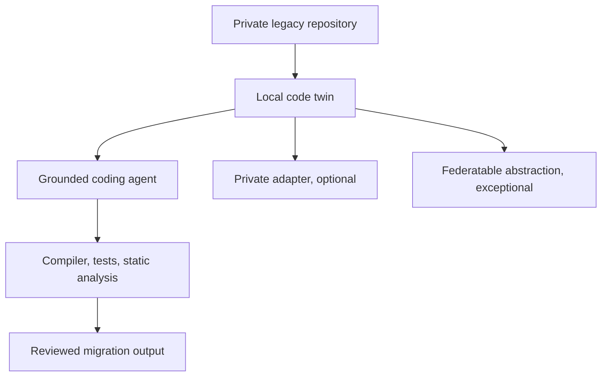

# Architecture

[Overview](../../README.md) · [Architecture](architecture.md) · [Workflow](workflow.md) · [Toolchain](toolchain.md) · [Governance](governance.md) · [Deutsch](../de/architecture.md)

## Design objective

Create a customer-local migration system that can understand proprietary software, generate bounded changes, and verify behaviour without exporting source code or customer-specific learned artefacts.

## Local code twin

The code twin is the primary source of customer context. It combines:

- repository inventory and provenance;
- parsers, ASTs, symbol and call graphs;
- schemas, copybooks, data flow, transactions, and batch dependencies;
- tests, tickets, documentation, and version history where authorised;
- explicit uncertainty for unsupported syntax or missing behaviour.

It remains inside the customer boundary. Source files, chunks, embeddings, graphs, identifiers, and traces are not central learning objects.

## Model layers

| Layer | Purpose | Boundary |
|---|---|---|
| General code model | public language and coding capability | identical approved model per site |
| Local retrieval | customer system context | customer only |
| Private adapter | customer conventions and recurring local patterns | customer only |
| Federated migration adapter | approved generic transformation capability | protected aggregation only |
| Verifier | compiler, tests, analysis, policy gates | local release authority |

## Legacy-specific design

COBOL, JCL, PL/SQL, and Oracle Forms require different parsers and verification strategies. A shared intermediate representation may connect them, but it must preserve control flow, data layouts, transactions, side effects, scheduling, and UI-trigger semantics. Translation quality is determined by behavioural equivalence, not syntactic similarity.

## Architecture decision still required

For every migration slice, the target architecture, required equivalence, tolerated redesign, authoritative tests, and rights to use the source must be decided explicitly before generation or training.
