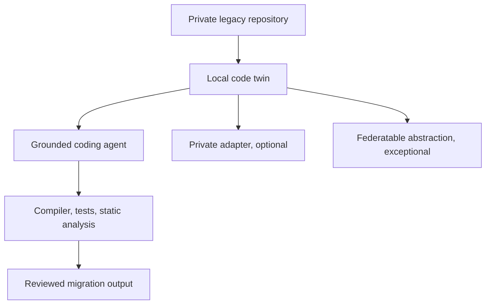
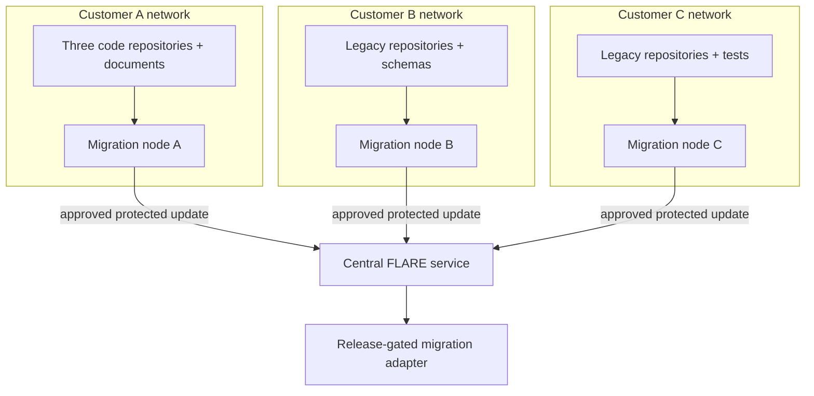

# Architecture

[Overview](../../README.md) · [Architecture](architecture.md) · [Deployment](deployment.md) · [Sizing](sizing.md) · [Workflow](workflow.md) · [Toolchain](toolchain.md) · [Governance](governance.md) · [Deutsch](../de/architecture.md)

## Design objective

Create a customer-local migration system that can understand proprietary software, generate bounded changes, and verify behaviour without exporting source code or customer-specific learned artefacts.

## Local code twin

The code twin is the primary source of customer context. It combines:

- repository inventory and provenance;
- parsers, ASTs, symbol and call graphs;
- schemas, copybooks, data flow, transactions, and batch dependencies;
- tests, tickets, documentation, and version history where authorised;
- explicit uncertainty for unsupported syntax or missing behaviour.

It remains inside the customer boundary. Source files, chunks, embeddings, graphs, identifiers, and traces are not central learning objects.

## Source estate and ingestion contracts

The local system must treat a legacy estate as a collection of governed sources, not as one Git repository.

| Source type | Local extraction | Required provenance |
|---|---|---|
| Git, Subversion, mainframe libraries, file shares | immutable snapshot, language detection, dependency and ownership inventory | system, path, revision, acquisition time, rights decision |
| COBOL, JCL, copybooks, PL/SQL, Oracle Forms exports | parser-specific structures, symbols, call and data-flow edges | parser/version, source span, parse confidence, unresolved constructs |
| PDF, Word, wiki, ticket and runbook material | text/OCR plus page or object anchors; retrieval support only unless separately approved | source ID, version, page/object anchor, extraction method, access decision |
| database schemas and approved metadata | tables, constraints, procedures, data lineage; no production rows by default | export method, schema version, scope, redaction decision |
| build scripts, compilers, tests and runtime traces | executable verification harness and behavioural observations | toolchain version, environment, test identity, result and timestamp |

Documentation is evidence, not executable truth. Generated code must be checked against parsers, compilers, tests, schema constraints, and human review. Unsupported or binary artefacts are inventoried and quarantined rather than silently ignored.

## Physical deployment: one on-premises migration node per customer

Customer source systems commonly cannot be moved to a shared cloud. The reference pattern therefore places a hardened “migration node” beside each authorised source estate. This is an architectural role, not a named product or a claim of appliance certification.

## Migration node security zones

| Zone | Components | Data rule |
|---|---|---|
| Source connectors | read-only repository mirrors, file-share/PDF ingestion, schema export adapters | pull only from explicitly approved paths and revisions |
| Analysis enclave | parsers, code graph, retrieval index, lineage store, policy classifier | all customer identifiers and derived representations remain local |
| Training enclave | approved base model, private adapter, optional federatable adapter, GPU runtime | separate private and export-eligible datasets and checkpoints |
| Verification enclave | compiler, database sandbox, test harness, static/security analysis | no generated change leaves without deterministic and human gates |
| Exchange gateway | FLARE client, outbound proxy, update filter, signing key, quarantine queue | only allowlisted job inputs and protected learning outputs cross the boundary |
| Evidence store | local append-only logs, manifests, SBOMs, approvals and test reports | content-bearing evidence remains customer-local; central records use references and hashes |

The node should run from signed, pinned images or packages, use hardware-backed keys where available, encrypt local stores, separate administrator roles, disable general internet access, and expose no repository service to the central operator.

## Connectivity profiles

FLARE is not treated as customer-to-customer peer networking. Clients normally connect to the central server, and direct ad-hoc connections remain disabled; NVIDIA describes this default topology in its [communication configuration](https://nvflare.readthedocs.io/en/main/user_guide/admin_guide/configurations/communication_configuration.html).

| Profile | Federation behavior | Boundary control |
|---|---|---|
| Connected | migration node maintains an outbound authenticated and encrypted session to fixed FLARE endpoints | firewall allowlist, proxy inspection policy, mutual identity, certificate rotation, no inbound route |
| Intermittently connected | node opens an approved time window, receives a signed job, performs local work, then uploads a protected update from quarantine | two-person release, payload manifest, hash/signature verification, timeout and replay protection |
| Fully disconnected | no live federated round; approved job and result packages move through an organisation-controlled transfer process | malware scan, media register, dual control, cryptographic verification, explicit export decision |

A fully disconnected site is therefore not “peer-to-peer FLARE.” It is a separate governed import/export workflow and may not meet synchronous aggregation assumptions. The POC must measure dropout, retry, stale-update, and rollback behavior for the selected connectivity profile.

## Centrally visible versus customer-local evidence

Central evidence may contain site pseudonym, job and model version, signed update hash, policy outcome, cohort participation, privacy parameters, aggregate metrics, and release decision. Repository URLs, filenames, source fragments, prompts, embeddings, code graphs, compiler logs containing code, private adapters, and detailed migration outputs remain local. NVIDIA FLARE provides PKI, federated authorisation, site policy, privacy filters, and auditing primitives, but the implementation must bind them to the customer network controls and evidence model; see [FLARE security](https://nvidia.github.io/NVFlare/security/).

## Model layers

| Layer | Purpose | Boundary |
|---|---|---|
| General code model | public language and coding capability | identical approved model per site |
| Local retrieval | customer system context | customer only |
| Private adapter | customer conventions and recurring local patterns | customer only |
| Federated migration adapter | approved generic transformation capability | protected aggregation only |
| Verifier | compiler, tests, analysis, policy gates | local release authority |

## Legacy-specific design

COBOL, JCL, PL/SQL, and Oracle Forms require different parsers and verification strategies. A shared intermediate representation may connect them, but it must preserve control flow, data layouts, transactions, side effects, scheduling, and UI-trigger semantics. Translation quality is determined by behavioural equivalence, not syntactic similarity.

## Architecture decision still required

For every migration slice, the target architecture, required equivalence, tolerated redesign, authoritative tests, and rights to use the source must be decided explicitly before generation or training.
