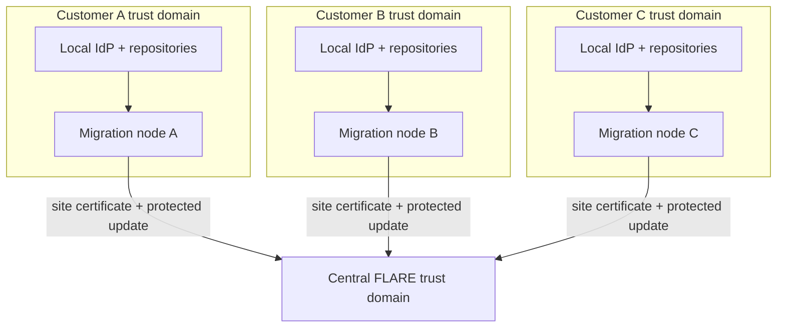
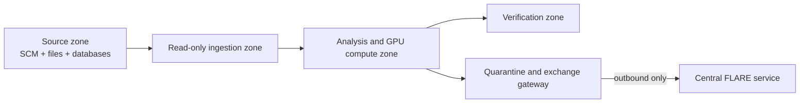

# Deployment design

[Overview](../../README.md) · [Architecture](architecture.md) · [Deployment](deployment.md) · [Sizing](sizing.md) · [Workflow](workflow.md) · [Toolchain](toolchain.md) · [Governance](governance.md) · [Deutsch](../de/deployment.md)

## Status and scope

This is a reviewable low-level reference design for a synthetic three-customer POC and a possible multi-customer service. It is not a certified appliance, bill of materials, production configuration, or permission to connect to a customer network. Exact hardware, operating system, model, endpoints, and controls require customer approval and benchmarking in a separate private implementation repository.

## Cross-organisation trust model

Unlike the centrally hosted consulting use case, every legacy estate belongs to a different customer organisation and identity domain. Customer A may use Active Directory, customer B Entra ID, and customer C LDAP or mainframe RACF. These identity providers are not merged and do not need to trust the central operator.

Local repository access is authenticated exclusively by customer-owned identities stored in the customer credential boundary. The central service sees only the FLARE site identity. FLARE PKI provides federation identity; it must not become a bridge through which the central operator can authenticate to a repository or customer IdP.

| Identity | Issuer | Valid at | Never valid at |
|---|---|---|---|
| repository service account | customer IdP | explicitly approved local repositories | FLARE hub or another customer |
| migration-node administrator | customer IdP | local node management plane | central model administration unless separately assigned |
| FLARE site certificate | federation CA | client-to-server FLARE channel | repository, database or human login |
| federation operator identity | central operator IdP | job approval and central FLARE operations | customer repositories and local evidence store |
| artefact signer | controlled build service | image/job/model signature verification | interactive access |

## Migration-node physical pattern

The five zones may be VLANs, virtual networks, VM security groups, Kubernetes network policies, or a combination. A single physical server can host them for a synthetic POC, but production assurance depends on independent credentials, filesystems, process isolation, routing controls and audit logs—not labels alone.

## Reference hardware envelopes

| Profile | CPU and memory | GPU | Local storage | Network | Purpose |
|---|---|---|---|---|---|
| inventory node | 16–32 cores, 128 GB RAM | none | 2–4 TB encrypted enterprise SSD | 1/10 GbE | repository inventory, parsing, graphs and RAG |
| migration POC | 32–64 cores, 256–512 GB RAM | 1 GPU with 48–80 GB VRAM | 4–8 TB mirrored NVMe plus backup target | 10 GbE | 7B–14B-class local inference and LoRA experiments |
| larger pilot | 64–128 cores, 512 GB–1 TB RAM | 2–4 approved GPUs with 48–80 GB VRAM each | 8–20 TB resilient NVMe | 10/25 GbE | larger context, concurrent parsing, evaluation and controlled training |

Include TPM 2.0 or an approved hardware key store, secure boot where supported, redundant power, out-of-band management on a separate administrative network, and encrypted backup. GPU count is driven by measured model footprint, context length, quantisation, adapter rank and concurrency. No model-size claim is a procurement guarantee.

The [sizing and performance model](sizing.md) converts 1, 10, 20 and 50 MLOC into token and chunk ranges, separates per-system capacity drivers, and defines the benchmark gate required before procurement.

## Reference software allocation

| Layer | Candidate | Deployment rule |
|---|---|---|
| host | supported hardened Linux distribution | minimal packages, full-disk encryption, measured patch baseline |
| containers | containerd/Kubernetes or rootless Podman/Docker pattern | signed digest-pinned images; separate FLARE parent and job image |
| GPU runtime | approved NVIDIA driver and Container Toolkit | version compatibility matrix recorded per release |
| source ingestion | customer-approved read-only connector processes | one credential and allowlist per source; no central callback |
| code twin | language parsers, PostgreSQL/pgvector and graph/index components | customer-local namespace and encryption keys |
| training | approved base model, PEFT/LoRA runtime and FLARE client | private and export-eligible workspaces physically or cryptographically separated |
| verification | compilers, database sandbox, test harness and static/security analysis | no network path to production write endpoints |
| evidence | append-only local log and manifest store | detailed evidence local; signed summary exported |

Open-weight models, proprietary compilers and customer database products require independent terms and approvals even when the orchestration code is open source.

## Source connector matrix

Enable only the rows required by the approved scope.

| Source | Typical protocol/port | Minimum access | Local capture |
|---|---:|---|---|
| Git over HTTPS | TCP 443 | read one repository/ref | commit-addressed mirror and manifest |
| Git over SSH | TCP 22 | deploy key with read only | commit-addressed mirror and manifest |
| Subversion | TCP 443 or 3690 | read selected paths/revisions | immutable export plus revision metadata |
| SMB file share | TCP 445 | read selected directories | hashed snapshot with ACL/provenance record |
| NFS | TCP 2049 plus environment-specific RPC rules | read-only export | hashed snapshot with mount/export identity |
| z/OS transfer gateway | customer-defined SFTP/managed-transfer port | read approved libraries/members | EBCDIC-aware snapshot and transfer manifest |
| Oracle metadata | TCP 1521 or customer-defined listener | catalog/schema metadata; no production DML | schema DDL, object IDs and extraction log |
| PDF/Word/file repository | source-specific read protocol | selected documents only | original hash, extracted text/OCR, page/object anchors |

These are common protocol defaults, not blanket firewall requests. The customer network owner provides final endpoints and may replace direct access with a staged, approved export. Production data rows, credentials in source code, binaries and unsupported files are quarantined by policy.

## Federation and infrastructure ports

| Source | Destination | Protocol/port | Direction and control |
|---|---|---:|---|
| migration node | customer DNS | UDP/TCP 53 | local infrastructure only |
| migration node | customer time source | UDP 123 | local trusted time only |
| exchange gateway | central FLARE endpoint | fixed provisioned TCP port, POC candidate 8002 | outbound session; firewall destination allowlist and mTLS |
| approved operations runner | central FLARE administration endpoint | separately provisioned fixed TCP port, POC candidate 8003 | central operations network only |
| migration node | customer-controlled registry or update mirror | TCP 443 | digest-pinned images and signed updates |
| migration node | customer SIEM collector | TCP 443 or approved collector port | security and health events |

There is no inbound route from the hub to a migration node and no customer-to-customer route. Direct FLARE ad-hoc connections are disabled. Hostnames and ports are fixed during provisioning and bound to site certificates and firewall rules. NVIDIA documents server-connected clients as the backbone topology and requires provisioned hostnames and ports to match network configuration. See [communication configuration](https://nvflare.readthedocs.io/en/main/user_guide/admin_guide/configurations/communication_configuration.html) and [deployment overview](https://nvflare.readthedocs.io/en/main/user_guide/admin_guide/deployment/overview.html).

## Connected, intermittent and disconnected operation

| Mode | Job delivery | Result release | Federation consequence |
|---|---|---|---|
| connected | preinstalled signed job selected through FLARE | filtered protected update sent in the active round | normal hub-and-spoke round with timeout and cohort policy |
| intermittent | signed package downloaded during an approved window and held in quarantine | two-person approval releases a signed update package during a later window | asynchronous/stale-update policy required; server must reject expired round IDs |
| disconnected | controlled removable media or customer transfer station | controlled export through the same channel | no live FLARE session; separate batch aggregation process and explicit export decision |

“Offline” is not peer-to-peer federation. A fully disconnected site is a governed package exchange and must be assessed separately from FLARE's connected runtime assumptions.

## Certificate and artefact lifecycle

1. Federation security approves the project manifest, organisations, site names and fixed endpoints.
2. A controlled provisioning ceremony generates signed startup kits and unique participant credentials.
3. Each customer organisation administrator receives only its own kit through an authenticated channel and verifies its hash.
4. The site private key is imported into the local protected store and is never returned to the central operator.
5. Parent and job images, policies, parser packs and model manifests are signed and admitted by digest.
6. Compromise triggers site revocation, firewall block, kit replacement and exclusion of updates after the last trusted round.
7. Disconnected sites receive an updated trust and revocation bundle with every approved package exchange.

FLARE documents participant startup kits, signed contents, PKI identities and site-controlled policies. See [FLARE provisioning and deployment](https://nvflare.readthedocs.io/en/main/user_guide/admin_guide/deployment/overview.html) and [FLARE security](https://nvidia.github.io/NVFlare/security/).

## Data and update release contract

The exchange gateway implements a positive schema: job ID, round ID, base-model digest, adapter schema, declared tensors, clipping result, privacy metadata, aggregate-safe metrics, update hash and site signature. Everything not declared is rejected. Filenames, repository URLs, symbols, source spans, prompts, retrieved chunks, embeddings, graphs, compiler output containing code, private checkpoints and credentials are prohibited centrally.

Encryption in transit does not decide whether an update is permissible. Rights classification, update inspection, clipping/privacy controls, minimum cohort, leakage testing and customer-approved reuse purpose remain release conditions.

## Operations and evidence ownership

| Responsibility | Customer organisation | Central federation operator |
|---|---:|---:|
| repository rights and credentials | accountable | no access |
| local node hardening and patch window | accountable/approver | supplies signed baseline |
| local source manifest and detailed training lineage | retains | receives signed reference/hash only |
| FLARE CA and server operations | reviews trust terms | accountable |
| job and model release | local acceptance required | prepares and signs candidate |
| update export | explicit local policy decision | cannot override |
| aggregate evaluation and common release | consulted | accountable with model-risk approval |
| incident containment | blocks local routes and identity | revokes site and rounds, coordinates evidence |

Every run produces a local evidence package containing source snapshot IDs, access decision, parser coverage, dataset split, tool/model/image digests, SBOM, policy version, test results, export decision and retention deadline. The central package contains site pseudonym, signed references and hashes, round/cohort evidence, privacy settings, aggregate metrics, release approvals and deployment status.

## Availability, backup and recovery

Repository mirrors and derived indexes are reproducible from approved snapshots; private adapters, test evidence and manifests require encrypted local backup. The central service backs up signed configuration, aggregate state, audit records and released adapters. It never backs up customer code. The POC must test node rebuild, certificate revocation, partial round failure, stale update rejection, corrupted package quarantine and restoration without cross-customer content.

Production central high availability must follow the topology supported by the exact pinned FLARE release. Generic replication of a stateful coordinator is not accepted without a failover test.

## Implementation sequence and acceptance

1. Build three synthetic estates representing Git/COBOL, PL/SQL/schema and Oracle Forms/PDF inputs.
2. Deploy one migration node per synthetic customer with different local identity simulations.
3. Prove that the hub has no credential or route to any source system.
4. Provision unique FLARE site kits and fixed outbound-only network paths.
5. Run inventory, parsing, RAG and verification locally before enabling training.
6. Run private LoRA, then a separately classified federated adapter with canary material.
7. Exercise connected, intermittent and controlled disconnected transfers.
8. Red-team malicious jobs, undeclared fields, replay, stale updates, route escape and memorisation.
9. Benchmark compute, storage, network, recovery and operator effort.
10. Produce a joint customer/central risk acceptance before any real-code pilot.

Acceptance requires zero central repository access, zero customer-to-customer routes, reproducible local provenance, schema-constrained exports, successful revocation and recovery, verified migration behavior, and documented residual copyright and privacy risk.
