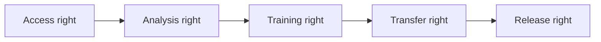

# Governance

[Overview](../../README.md) · [Architecture](architecture.md) · [Deployment](deployment.md) · [Sizing](sizing.md) · [Workflow](workflow.md) · [Toolchain](toolchain.md) · [Governance](governance.md) · [Deutsch](../de/governance.md)

## Governing principle

Technical access to a repository does not establish the right to analyse it, train on it, generate derivatives, transfer learning signals, or reuse results for another customer. Those are separate decisions.

## Artefact classes

| Class | Example | Default treatment |
|---|---|---|
| Open and compatible | verified permissively licensed samples | POC use after provenance review |
| Customer-local | proprietary code and documentation | local analysis and RAG only |
| Customer-local training | explicitly approved examples | private adapter only |
| Federatable abstraction | approved synthetic or abstract pattern | protected aggregation after leakage checks |
| Unknown or prohibited | unclear rights, vendor code, secrets | deny and quarantine |

## Required controls

- repository and commit-level provenance;
- licence, copyright-header, secret, and third-party-code scanning;
- separation of generated, vendor, test, and first-party source;
- output similarity and clone detection;
- compiler, regression, security, and data-equivalence tests;
- private handling of prompts, traces, rewards, embeddings, and adapters;
- human approval of migration meaning, not just syntax;
- recall and deletion procedures for derived artefacts.

## Release gate

Generated code is not released solely because it compiles. It must pass behavioural tests, security and licence checks, provenance review, similarity thresholds, and accountable human approval. A federated adapter additionally requires cross-customer leakage testing and an explicit contractual basis.

## Repository publication

This public repository contains descriptions only. [Publication Policy](../../PUBLICATION_POLICY.md) governs content admission, [Open-Source Tool Baseline](../../OPEN_SOURCE_BASELINE.md) governs tool claims, and the automated publication gate provides minimum scanning. Human review remains mandatory.
