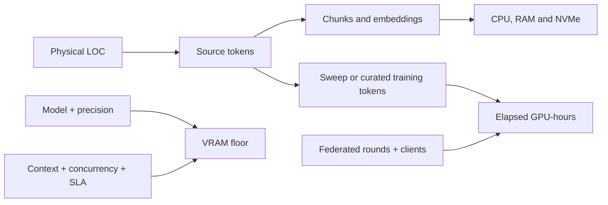

# Sizing and performance model

[Overview](../../README.md) · [Architecture](architecture.md) · [Deployment](deployment.md) · [Sizing](sizing.md) · [Workflow](workflow.md) · [Toolchain](toolchain.md) · [Governance](governance.md) · [Deutsch](../de/sizing.md)

## Decision summary

Lines of code size the source-analysis estate; they do not determine GPU count by themselves. CPU, RAM and storage follow repository count, languages, history, generated artefacts and graph complexity. GPU capacity follows model size, precision, context length, concurrency, latency target, training method and the number of evaluation or federated rounds.

These initial envelopes are benchmark hypotheses, not a bill of materials or procurement guarantee. A synthetic representative slice must validate them before customer code is used.



## What is and is not post-training

| Activity | Weights change? | Capacity driver |
|---|---:|---|
| inventory, parsing, graphs and code twin | no | files, languages, CPU, RAM and storage |
| local retrieval and tool use | no | context, concurrency and input/prefill throughput |
| private SFT or LoRA/PEFT | yes | curated tokens, epochs, model, precision and VRAM |
| federated adapter training | yes | local training cost per round plus clients and rounds |
| preference- or verifier-guided RL | yes | rollouts, verifier cost and evaluation |

Private fine-tuning and federated adapter training are both post-training in the broad technical sense. Preference or RL is a later, specialised post-training stage. Reading code through retrieval is not training.

## Transparent LOC conversion

Physical LOC is only an inventory measure. Blank lines, generated code, copybooks, SQL, minified files and language mix prevent a universal ratio. Until the selected tokenizer measures the repositories, use 6–20 model tokens per physical LOC, with 10 as the planning midpoint. Assume 512-token chunks with about 12% overlap, approximately 450 new tokens per chunk, and 8 KiB per chunk for vector and metadata before replicas and backups.

```text
source_tokens = physical_LOC × measured_tokens_per_LOC
chunks = source_tokens / (chunk_tokens × (1 - overlap))
sweep_seconds = source_tokens × passes / measured_effective_input_tokens_per_second
training_tokens = source_tokens × approved_curated_fraction × epochs
```

| Estate | Token range at 6–20/LOC | Midpoint | Approx. chunks | Vector + metadata |
|---:|---:|---:|---:|---:|
| 1 MLOC | 6–20 M | 10 M | 22,000 | 0.2 GiB |
| 10 MLOC | 60–200 M | 100 M | 222,000 | 1.7 GiB |
| 20 MLOC | 120–400 M | 200 M | 444,000 | 3.4 GiB |
| 50 MLOC | 300 M–1 B | 500 M | 1,111,000 | 8.5 GiB |

The vector store is not the dominant reservation. Mirrors and history, ASTs and graphs, intermediate representations, build artefacts, tests, compiler sandboxes, evidence, rebuild headroom and encrypted backups usually dominate it.

## Initial customer-node envelopes

These ranges assume a mixed legacy estate, local 7B–14B-class inference, optional LoRA experiments and reproducible indexes.

| Estate | Analysis and verification | Working storage | GPU benchmark start | Operating pattern |
|---:|---|---:|---|---|
| 1 MLOC | 16–32 cores, 128–256 GB RAM | 1–2 TB NVMe | optional 1 × 48 GB | narrow slice; serial evaluation |
| 10 MLOC | 32–64 cores, 256–512 GB RAM | 2–4 TB NVMe | 1 × 48–80 GB | several repositories; scheduled refresh |
| 20 MLOC | 64–96 cores, 512–768 GB RAM | 4–8 TB NVMe | 1 × 80–141 GB or 2 × 48–80 GB | parallel parsing, retrieval and evaluation |
| 50 MLOC | 96–192 cores, 768 GB–1.5 TB RAM | 8–20 TB NVMe | 2–4 × 80–141 GB | partitioned indexes and training windows |

The GPU column is a starting point, not a consequence of LOC. A 20-MLOC estate with a small model and low concurrency may use one 48 GB GPU; a 1-MLOC estate with a 70B model, long contexts and high concurrency may require several. NVIDIA publishes 48 GB for [L40S](https://www.nvidia.com/en-us/data-center/l40s/), 80 GB for [H100 SXM](https://www.nvidia.com/en-eu/data-center/h100/) and 141 GB for [H200 configurations](https://docs.nvidia.com/enterprise-reference-architectures/whitepaper/hgx-servers-and-spectrum-x.pdf). Runtime, activations, buffers and KV cache reduce usable model capacity.

## Sizing by system role

| System role | Scales with | Initial shape |
|---|---|---|
| source connectors | repositories and change rate | 4–16 cores, 16–64 GB RAM per pool; no GPU |
| parser/code-twin workers | LOC, languages and graph edges | horizontally partition the analysis envelope |
| index/database | chunks, metadata, concurrency and replicas | hot-index RAM plus at least 30% rebuild headroom |
| GPU inference/training | model, precision, context, batch and SLA | benchmark 48/80/141 GB classes; isolate training windows |
| verification workers | compilers, builds and test parallelism | separate CPU/RAM pools sized by clean-build and regression time |
| customer exchange gateway | updates and policy checks, not LOC | 4–8 cores, 16–32 GB RAM, 100–250 GB; no GPU |
| central FLARE service | clients, rounds, adapter size and retention | 8–16 cores, 32–64 GB RAM, resilient 0.5–2 TB; GPU only for approved evaluation |

## Worked 20-MLOC example

At 10 tokens/LOC, 20 MLOC is about 200 million source tokens and 444,000 chunks. One full model-assisted sweep takes about 11.1 hours at 5,000 effective input tokens/s, 2.8 hours at 20,000, or 1.1 hours at 50,000. These are scenarios to measure, not GPU promises; multiply by passes and divide by observed utilisation.

The online path does not send all 200 million tokens for every question. It retrieves a bounded context, for example 8,000–32,000 input tokens. A full-estate sweep is an offline batch job.

If 2% becomes an expressly approved curated set and LoRA runs for three epochs, the volume is 12 million training-token presentations:

```text
200 M × 0.02 × 3 = 12 M training tokens
```

Federation does not remove local compute. Each participating client trains and evaluates in each round. The hub aggregates allowed updates; it does not train on a combined customer-source corpus.

## Interpreting NVIDIA tokens/s

Published results are comparable only when model, GPU, precision, parallelism, input/output lengths, concurrency, software version and latency objective match. NVIDIA's TensorRT-LLM overview, consulted on 13 September 2026, explicitly reports **output** tokens/s/GPU and excludes input tokens. On that page, one GPT-OSS 120B H200 configuration changes from 6,868 output tokens/s/GPU at ISL/OSL 1,000/1,000 to 519 at 32,768/1,024. A headline tokens/s value therefore cannot size code ingestion. See the [TensorRT-LLM performance overview](https://github.com/NVIDIA/TensorRT-LLM/blob/main/docs/source/developer-guide/perf-overview.md).

The benchmark must record ingestion MB/s and LOC/s, parser failures, embedding chunks/s, effective input/prefill tokens/s, request throughput, time to first token, inter-token latency, output tokens/s, peak VRAM/RAM/IOPS, index rebuild, LoRA and checkpoint time, per-round federation time, update size, compiler/test critical path, and quality/leakage/equivalence results.

NVIDIA distinguishes latency and throughput metrics in its [inference benchmarking concepts](https://developer.nvidia.com/blog/llm-inference-benchmarking-fundamental-concepts/) and documents workload sweeps with [GenAI-Perf](https://developer.nvidia.com/blog/llm-inference-benchmarking-guide-nvidia-genai-perf-and-nim/). The POC must replay representative code prompts with the exact approved open-source runtime. NIM results may inform comparison but do not make NIM part of this repository's strict open-source baseline.

## Procurement exit gate

Procurement input is ready only after a synthetic benchmark records the exact model and licence, tokenizer distribution by language, ISL/OSL percentiles, concurrency and latency SLO, quality target, index/build timings, post-training schedule, failure headroom, power/cooling constraints and measured candidate-system results.
