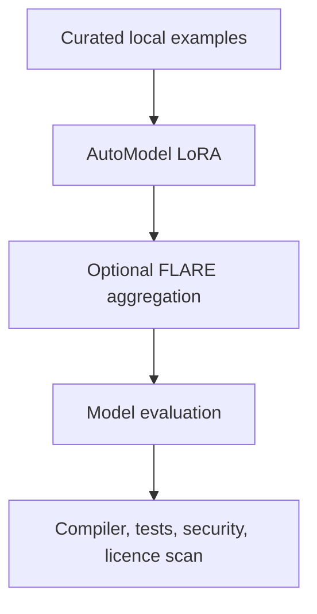

# Toolchain

[Overview](../../README.md) · [Architecture](architecture.md) · [Workflow](workflow.md) · [Toolchain](toolchain.md) · [Governance](governance.md) · [Deutsch](../de/toolchain.md)

## Recommended open-source-oriented stack

| Layer | Candidate | Role | Position |
|---|---|---|---|
| Code preparation | NeMo Curator plus code-specific filters | provenance, deduplication, decontamination | targeted local use |
| Fine-tuning | NeMo AutoModel | local SFT and LoRA/PEFT | preferred training layer |
| Federation | NVIDIA FLARE | policy-controlled adapter aggregation | optional after local proof |
| Evaluation | NeMo Evaluator plus compilers and tests | reproducible quality assessment | mandatory combined evidence |
| Post-training | NeMo RL | preference or verifier-guided learning | later stage only |
| Scale-up | NeMo Framework / Megatron Core | large or distributed training | only after measured need |
| Inference | TensorRT-LLM | optional local optimisation | after model validation |

The exact release, repository licence, bundled dependencies, container terms, base-model licence, and parser licences require verification before implementation. See [Open-Source Tool Baseline](../../OPEN_SOURCE_BASELINE.md).

NVIDIA NIM and NeMo Microservices are outside the strict open-source baseline and require a separate product decision.

## Verification tools remain authoritative

For code migration, a model score is never enough. Compilation, behavioural tests, data comparison, static analysis, security checks, similarity detection, and human review determine release suitability.
