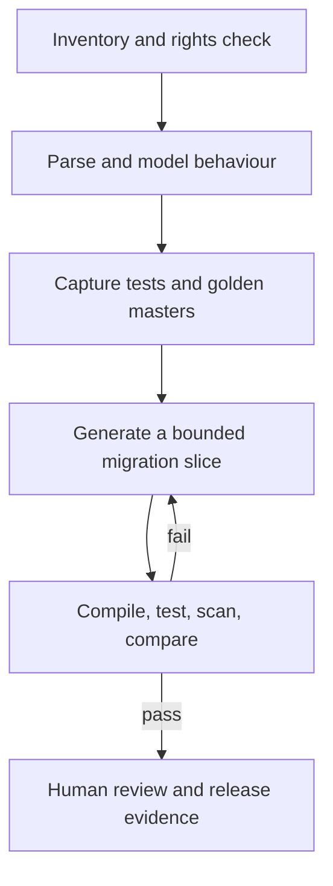

# Workflow

[Overview](../../README.md) · [Architecture](architecture.md) · [Workflow](workflow.md) · [Toolchain](toolchain.md) · [Governance](governance.md) · [Deutsch](../de/workflow.md)

## Migration lifecycle

## Capability stages

| Stage | Capability | Promotion test |
|---|---|---|
| 0 | deterministic inventory, parsing, and graphs | coverage and correctness |
| 1 | local RAG and tool use | grounded answers and bounded changes |
| 2 | private LoRA adapter | measurable gain over RAG-only |
| 3 | federated migration adapter | cross-site gain without prohibited leakage |
| 4 | preference or RL post-training | robust verifier and anti-gaming evidence |

## Vertical slice

A useful first POC chooses one narrow path, for example a COBOL batch calculation with copybook data and golden-master cases transformed into a small Java service. It does not attempt to migrate an entire estate.

The slice records:

- source dialect and build environment;
- behavioural contract and transaction boundaries;
- generated assumptions and unresolved semantics;
- compiler, unit, integration, security, and licence results;
- output similarity to protected source;
- human acceptance or rejection.

## Federation is optional

Federation begins only after the local pipeline is useful and measurable. Candidate shared objects are synthetic transformation patterns, generic error corrections, verifier outcomes, or explicitly approved abstractions. Complete files, ASTs, embeddings, symbols, customer identifiers, and individual updates remain local by default.

The workflow is a blueprint. Customer execution belongs in a separately approved private repository and environment.
